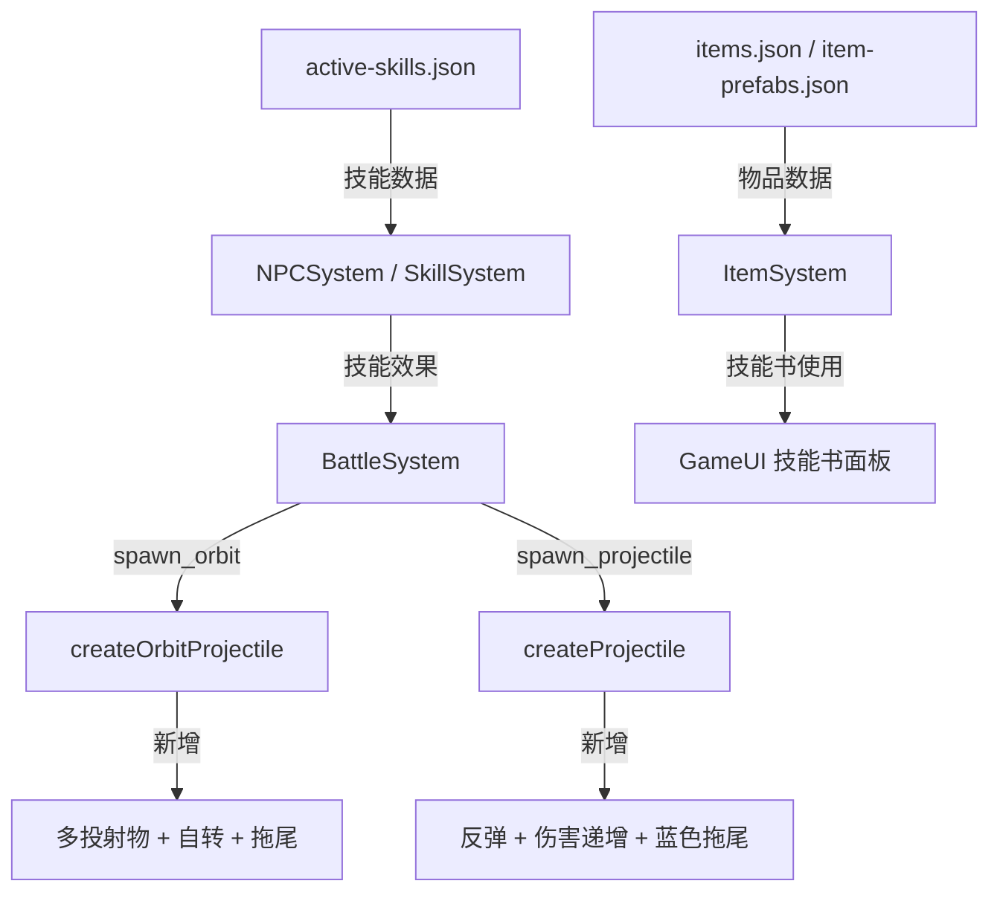

# 设计文档：主动技能投射物系统

## 概述

本设计为游戏添加两个新的主动技能（旋风飞斧、能量箭矢）及其对应的技能书物品。核心工作包括：
1. 在 `active-skills.json` 中添加技能数据配置
2. 在 `items.json` 和 `item-prefabs.json` 中添加技能书物品数据
3. 扩展 `BattleSystem` 的环绕投射物机制，支持多投射物生成、自转和拖尾效果
4. 扩展 `BattleSystem` 的线性投射物机制，支持场景边缘反弹和反弹伤害增加

## 架构

本功能基于现有的 ECS 架构，主要涉及以下系统的扩展：



数据流：
- 技能数据通过 JSON 配置驱动，BattleSystem 根据效果类型分发到对应的处理方法
- 技能书物品通过现有的 GameUI 技能书面板使用，调用已有的学习逻辑

## 组件与接口

### 1. 技能数据配置（active-skills.json）

#### 旋风飞斧（whirlwind_axe）

```json
{
  "id": "whirlwind_axe",
  "name": "旋风飞斧",
  "type": "active",
  "tag": "orbit",
  "rarity": "common",
  "icon": "images/zhudongjineng_xuanfengfeifu.png",
  "description": "用3个旋转的飞斧攻击敌人，伤害受攻击力影响",
  "effects": [
    {
      "type": "spawn_orbit",
      "image": "images/texiao_futou.png",
      "count": 3,
      "distance": 100,
      "lifetime": 6000,
      "rotationSpeed": 1.5,
      "selfSpin": true,
      "selfSpinSpeed": 2.0,
      "hasTrail": true,
      "trailColor": "red",
      "damage": {
        "base": 5,
        "attackMultiplier": 0.5
      },
      "knockback": {
        "base": 5,
        "strengthMultiplier": 0.5
      },
      "hitOnce": true
    }
  ]
}
```

#### 能量箭矢（energy_arrow）

```json
{
  "id": "energy_arrow",
  "name": "能量箭矢",
  "type": "active",
  "tag": "projectile",
  "rarity": "common",
  "icon": "images/zhudongjineng_nengliangjianshi.png",
  "description": "射出一支能量箭矢造成伤害，箭矢碰到场景边缘会反弹并增加伤害，伤害受攻击力影响",
  "effects": [
    {
      "type": "spawn_projectile",
      "image": "images/toushewu_jianshi.png",
      "size": 30,
      "targetRandom": false,
      "randomDirection": true,
      "destroyOnHit": true,
      "lifetime": 6000,
      "bounce": true,
      "bounceDamageIncrease": 5,
      "hasTrail": true,
      "trailColor": "blue",
      "speed": {
        "base": 600
      },
      "damage": {
        "base": 5,
        "attackMultiplier": 1.0
      }
    }
  ]
}
```

### 2. 物品数据配置

#### items.json 中的技能书条目

```json
{
  "id": "skill_book_whirlwind_axe",
  "name": "《旋风飞斧》技能书",
  "description": "古老的战斗秘籍，记载着一种以气旋之力驱动飞斧的独特战技。习得此术者可召唤三柄旋转飞斧环绕周身，斩杀来犯之敌。",
  "type": "consumable",
  "subTypes": ["skill_book"],
  "rarity": 0,
  "stackSize": 99,
  "baseValue": 1000,
  "canSell": true,
  "sellPrice": 1000,
  "canBuy": false,
  "buyPrice": 0,
  "canUse": true,
  "icon": "images/wupin_jinengshu.png",
  "weight": 1,
  "skillId": "whirlwind_axe"
}
```

```json
{
  "id": "skill_book_energy_arrow",
  "name": "《能量箭矢》技能书",
  "description": "以纯粹魔力凝聚而成的箭矢射术指南。书中描述的能量箭矢能在空间中不断弹射，每次反弹都会汲取周围的魔力而变得更加致命。",
  "type": "consumable",
  "subTypes": ["skill_book"],
  "rarity": 0,
  "stackSize": 99,
  "baseValue": 1000,
  "canSell": true,
  "sellPrice": 1000,
  "canBuy": false,
  "buyPrice": 0,
  "canUse": true,
  "icon": "images/wupin_jinengshu.png",
  "weight": 1,
  "skillId": "energy_arrow"
}
```

#### item-prefabs.json 中的技能书条目

```json
{
  "id": "skill_book_whirlwind_axe",
  "name": "《旋风飞斧》技能书",
  "description": "古老的战斗秘籍，记载着一种以气旋之力驱动飞斧的独特战技。习得此术者可召唤三柄旋转飞斧环绕周身，斩杀来犯之敌。",
  "type": "book",
  "subType": "skill_book",
  "icon": "images/wupin_jinengshu.png",
  "rarity": 0,
  "stackSize": 99,
  "weight": 1,
  "skillId": "whirlwind_axe",
  "effects": [],
  "canSell": true,
  "sellPrice": 1000,
  "canBuy": false,
  "buyPrice": 0,
  "canCraft": false,
  "craftRecipe": null,
  "canUse": false,
  "purchasePrice": 1000
}
```

```json
{
  "id": "skill_book_energy_arrow",
  "name": "《能量箭矢》技能书",
  "description": "以纯粹魔力凝聚而成的箭矢射术指南。书中描述的能量箭矢能在空间中不断弹射，每次反弹都会汲取周围的魔力而变得更加致命。",
  "type": "book",
  "subType": "skill_book",
  "icon": "images/wupin_jinengshu.png",
  "rarity": 0,
  "stackSize": 99,
  "weight": 1,
  "skillId": "energy_arrow",
  "effects": [],
  "canSell": true,
  "sellPrice": 1000,
  "canBuy": false,
  "buyPrice": 0,
  "canCraft": false,
  "craftRecipe": null,
  "canUse": false,
  "purchasePrice": 1000
}
```

### 3. BattleSystem 扩展

#### 3.1 环绕投射物扩展（createOrbitProjectile）

需要扩展的功能：
- **多投射物生成**：`applySpawnOrbitEffect` 读取 `effect.count`，循环调用 `createOrbitProjectile`，每个投射物的初始角度偏移为 `i * (2π / count)`
- **自转支持**：当 `effect.selfSpin === true` 时，为 orbital 元素添加独立的 CSS 旋转动画（`selfSpinSpeed` 控制自转速度）
- **拖尾效果**：当 `effect.hasTrail === true` 时，在 `animateOrbit` 循环中定期生成拖尾粒子，颜色由 `effect.trailColor` 决定

```typescript
// applySpawnOrbitEffect 扩展伪代码
private applySpawnOrbitEffect(caster: CharacterSprite, effect: any): void {
  const count = effect.count || 1;
  const totalDamage = /* 现有伤害计算 */;
  const totalKnockback = /* 现有击退计算 */;
  
  for (let i = 0; i < count; i++) {
    const angleOffset = (i * 2 * Math.PI) / count;
    this.createOrbitProjectile(caster, effect, totalDamage, totalKnockback, angleOffset);
  }
}
```

```typescript
// createOrbitProjectile 自转扩展伪代码
if (effect.selfSpin) {
  const spinSpeed = effect.selfSpinSpeed || 1.0;
  // 为 orbital 元素添加独立的 CSS animation
  orbital.style.animation = `orbit-self-spin ${1/spinSpeed}s linear infinite`;
}
```

```typescript
// createOrbitProjectile 拖尾扩展伪代码
// 在 animateOrbit 循环中：
if (effect.hasTrail && currentTime - lastTrailTime > 30) {
  createOrbitTrail(orbX, orbY, effect.trailColor);
  lastTrailTime = currentTime;
}
```

#### 3.2 线性投射物扩展（createProjectile）

需要扩展的功能：
- **随机方向发射**：当 `effect.randomDirection === true` 时，生成随机方向向量
- **反弹机制**：当 `effect.bounce === true` 且投射物碰到场景边缘时，生成新的随机方向而非销毁投射物
- **反弹伤害增加**：每次反弹时，`damage += effect.bounceDamageIncrease`
- **反弹后重置命中列表**：每次反弹时清空 `hitTargets` Set
- **蓝色拖尾**：在 `createTrail` 中支持 `blue` 颜色

```typescript
// createProjectile 反弹扩展伪代码
// 替换现有的出界销毁逻辑：
if (x < -size || x > containerWidth || y < -size || y > containerHeight) {
  if (effect.bounce) {
    // 将投射物位置限制在边界内
    x = Math.max(0, Math.min(x, containerWidth - size));
    y = Math.max(0, Math.min(y, containerHeight - size));
    
    // 生成新的随机方向
    const newAngle = Math.random() * Math.PI * 2;
    dirX = Math.cos(newAngle);
    dirY = Math.sin(newAngle);
    
    // 增加伤害
    damage += effect.bounceDamageIncrease || 0;
    
    // 重置命中列表
    hitTargets.clear();
  } else {
    removeProjectile();
    return;
  }
}
```

#### 3.3 发射方向扩展（applySpawnProjectileEffect）

```typescript
// 在方向判断逻辑中添加 randomDirection 支持：
if (effect.randomDirection) {
  const angle = Math.random() * Math.PI * 2;
  dirX = Math.cos(angle);
  dirY = Math.sin(angle);
}
```

## 数据模型

### 技能效果扩展字段

| 字段 | 类型 | 适用效果类型 | 说明 |
|------|------|-------------|------|
| `count` | number | spawn_orbit | 生成的环绕投射物数量 |
| `selfSpin` | boolean | spawn_orbit | 是否启用自转 |
| `selfSpinSpeed` | number | spawn_orbit | 自转速度（圈/秒） |
| `hasTrail` | boolean | spawn_orbit, spawn_projectile | 是否启用拖尾效果 |
| `trailColor` | string | spawn_orbit, spawn_projectile | 拖尾颜色（"red", "blue" 等） |
| `randomDirection` | boolean | spawn_projectile | 是否朝随机方向发射 |
| `bounce` | boolean | spawn_projectile | 是否在场景边缘反弹 |
| `bounceDamageIncrease` | number | spawn_projectile | 每次反弹增加的伤害值 |

## 正确性属性

*正确性属性是一种在系统所有有效执行中都应成立的特征或行为——本质上是关于系统应该做什么的形式化陈述。属性作为人类可读规范和机器可验证正确性保证之间的桥梁。*

### Property 1：伤害计算公式正确性
*对于任意*施法者攻击力值和任意技能伤害配置（base, attackMultiplier），计算出的伤害应等于 `base + attack × attackMultiplier`
**Validates: Requirements 1.4, 3.4**

### Property 2：反弹伤害递增
*对于任意*初始伤害值和任意反弹次数 N，反弹后的伤害应等于 `初始伤害 + N × bounceDamageIncrease`
**Validates: Requirements 4.3, 7.2**

### Property 3：反弹后投射物存活
*对于任意*配置了 `bounce: true` 的投射物，当其到达场景边缘时，投射物应保持存活状态且位置被限制在场景边界内
**Validates: Requirements 7.1**

### Property 4：反弹后命中列表重置
*对于任意*配置了 `bounce: true` 的投射物，在反弹后其已命中目标列表应被清空，使其可以再次命中之前命中过的敌人
**Validates: Requirements 7.3**

### Property 5：技能书使用学习技能
*对于任意*技能书物品（含有 skillId 字段），当角色使用该技能书时，角色的 learnedActiveSkills 列表应包含该 skillId，且背包中该技能书数量减少 1
**Validates: Requirements 5.3, 5.4**

## 错误处理

| 场景 | 处理方式 |
|------|---------|
| 技能数据中缺少 `count` 字段 | 默认为 1（向后兼容现有技能） |
| 技能数据中缺少 `selfSpin` 字段 | 默认为 false（不自转） |
| 技能数据中缺少 `bounce` 字段 | 默认为 false（不反弹，保持现有行为） |
| 角色已学习该技能时使用技能书 | 提示"已学习该技能"，不消耗技能书 |
| 投射物反弹时方向向量为零 | 重新生成随机方向 |
| 施法者在投射物存活期间死亡 | 移除该施法者的所有环绕投射物 |

## 测试策略

### 单元测试

- 验证 `active-skills.json` 中旋风飞斧和能量箭矢的数据结构正确性
- 验证 `items.json` 和 `item-prefabs.json` 中技能书物品的数据结构正确性
- 验证伤害计算函数对特定输入值的输出
- 验证反弹逻辑在边界条件下的行为（角落反弹、连续反弹等）

### 属性测试

使用 `fast-check` 库进行属性测试，每个属性测试至少运行 100 次迭代。

- **Property 1**：生成随机攻击力值和伤害配置，验证伤害计算公式
  - Tag: **Feature: active-skills-projectile-system, Property 1: 伤害计算公式正确性**
- **Property 2**：生成随机初始伤害和反弹次数，验证反弹后伤害递增
  - Tag: **Feature: active-skills-projectile-system, Property 2: 反弹伤害递增**
- **Property 3**：生成随机投射物位置和场景边界，验证反弹后投射物存活
  - Tag: **Feature: active-skills-projectile-system, Property 3: 反弹后投射物存活**
- **Property 4**：生成随机已命中目标列表，验证反弹后列表被清空
  - Tag: **Feature: active-skills-projectile-system, Property 4: 反弹后命中列表重置**
- **Property 5**：生成随机角色和技能书，验证使用后技能学习和物品消耗
  - Tag: **Feature: active-skills-projectile-system, Property 5: 技能书使用学习技能**
