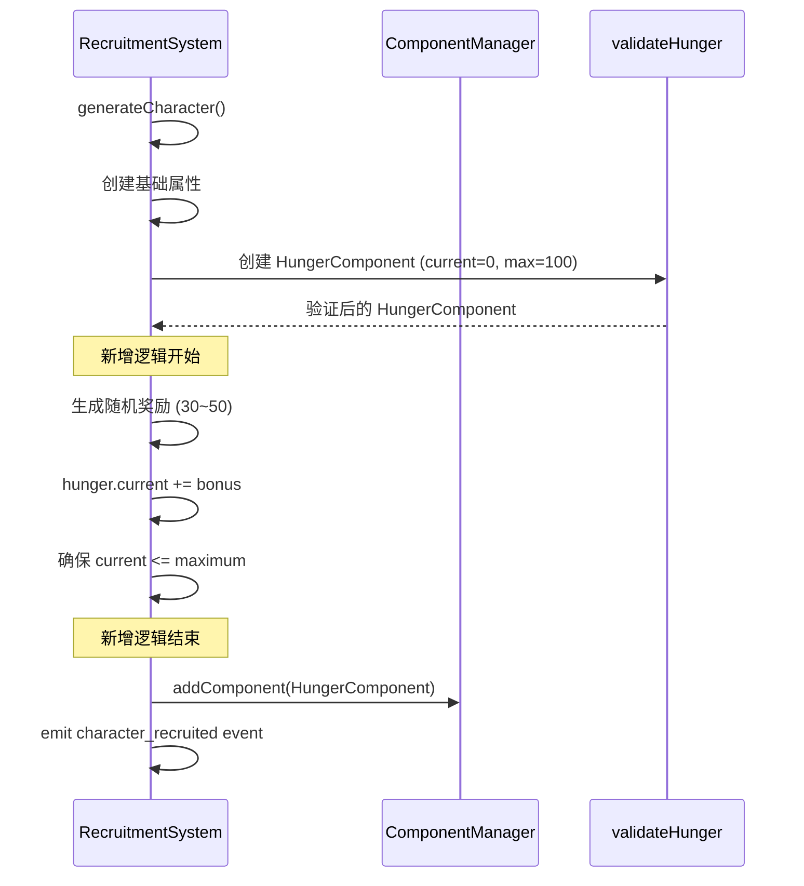

# 设计文档：冒险者和异界角色饱腹度奖励

## 概述

本功能在角色招募系统中添加饱腹度奖励机制。当生成新的冒险者角色或异界角色时，系统会为其当前饱腹度增加30~50的随机值。这个改动只需要在 `CharacterRecruitmentSystem.ts` 的 `generateCharacter` 方法中添加少量代码。

## 架构

### 改动点

只需修改一个文件：`src/game/systems/CharacterRecruitmentSystem.ts`

在 `generateCharacter` 方法中，创建 HungerComponent 后，添加饱腹度奖励逻辑。

### 流程图



## 实现细节

### 修改位置

在 `CharacterRecruitmentSystem.ts` 的 `generateCharacter` 方法中，找到创建 HungerComponent 的代码：

```typescript
// 当前代码（第267-272行左右）
const hunger: HungerComponent = validateHunger({
  type: 'hunger',
  current: 0,
  maximum: 100
});
```

### 新增代码

在创建 HungerComponent 之后，添加组件之前，插入以下逻辑：

```typescript
// 创建 HungerComponent
const hunger: HungerComponent = validateHunger({
  type: 'hunger',
  current: 0,
  maximum: 100
});

// 新增：为冒险者和异界角色添加饱腹度奖励
// Requirement 1.1, 1.2, 2.1, 2.2, 3.1, 3.2
const hungerBonus = Math.floor(Math.random() * 21) + 30; // 30~50 的随机整数
hunger.current = Math.min(hunger.current + hungerBonus, hunger.maximum);
```

### 随机数生成说明

- `Math.random()` 生成 [0, 1) 的随机数
- `Math.random() * 21` 生成 [0, 21) 的随机数
- `Math.floor(Math.random() * 21)` 生成 [0, 20] 的随机整数
- `Math.floor(Math.random() * 21) + 30` 生成 [30, 50] 的随机整数

### 边界检查

使用 `Math.min(hunger.current + hungerBonus, hunger.maximum)` 确保当前饱腹度不会超过最大值。虽然在当前实现中 current=0, maximum=100，奖励最多50，不会超过上限，但这个检查提供了额外的安全性。

## 正确性属性

*属性是系统在所有有效执行中应保持为真的特征或行为——本质上是关于系统应该做什么的形式化陈述。*

### Property 1: 饱腹度奖励范围

*For any* newly generated adventurer or otherworld character, the hunger bonus applied should be an integer value between 30 and 50 (inclusive).

**Validates: Requirements 1.1, 2.1, 3.2**

### Property 2: 当前饱腹度不超过最大值

*For any* character after hunger bonus is applied, the current hunger value should be less than or equal to the maximum hunger value.

**Validates: Requirements 1.3, 2.3, 4.2**

### Property 3: 最大饱腹度不变

*For any* character after hunger bonus is applied, the maximum hunger value should remain unchanged at 100.

**Validates: Requirements 1.4, 2.4, 4.3**

### Property 4: 饱腹度奖励独立性

*For any* two characters generated in sequence, their hunger bonuses should be independently generated and may differ.

**Validates: Requirements 3.1, 3.3**

## 受影响的组件

### 修改的文件

- `src/game/systems/CharacterRecruitmentSystem.ts` - 在 `generateCharacter` 方法中添加饱腹度奖励逻辑

### 不需要修改的文件

- `src/game/components/CharacterComponents.ts` - HungerComponent 接口无需改动
- `src/ecs/SaveSystem.ts` - 存档系统无需改动
- `src/game/data/characters.json` - 角色数据无需改动
- `src/game/data/otherworld-characters.json` - 异界角色数据无需改动

## 错误处理

| 场景 | 处理方式 |
|------|---------|
| 随机数生成失败 | 使用 Math.random() 是同步且可靠的，不会失败 |
| 奖励值超过上限 | 使用 Math.min() 确保不超过 maximum |
| validateHunger 失败 | 在添加奖励前已经验证过，添加奖励后的值仍然有效 |

## 测试策略

### 单元测试

- 测试生成100个角色，验证所有角色的饱腹度奖励都在 [30, 50] 范围内
- 测试饱腹度奖励后，current 值不超过 maximum
- 测试饱腹度奖励不影响 maximum 值

### 属性测试

使用 `fast-check` 库：

- 每个属性测试至少运行 100 次迭代
- 测试文件：`src/game/systems/CharacterRecruitmentSystem.hunger-bonus.property.test.ts`

属性测试覆盖：
1. Property 1：生成多个角色，验证每个角色的奖励值在 [30, 50] 范围内
2. Property 2：验证 current <= maximum 恒成立
3. Property 3：验证 maximum 始终为 100
4. Property 4：生成多个角色，验证奖励值的分布具有随机性

### 集成测试

- 测试通过金币招募冒险者，验证饱腹度奖励生效
- 测试通过特殊道具招募异界角色，验证饱腹度奖励生效
- 测试存档和读档，验证新招募的角色保留饱腹度值

## 性能影响

- 添加的代码只有2行，性能影响可忽略不计
- 随机数生成是 O(1) 操作
- 不涉及额外的数据库查询或文件 I/O

## 向后兼容性

- 现有存档中的角色不受影响
- 只有新招募的角色才会获得饱腹度奖励
- 不需要存档迁移或版本升级
