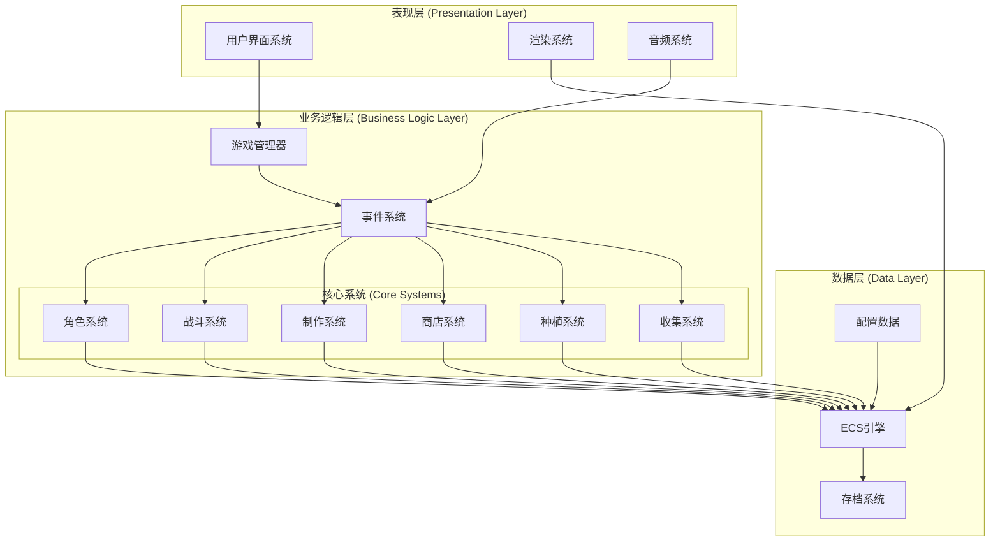

# 设计文档 - 代号：饭

## 概述

《代号：饭》是一款基于Entity-Component-System (ECS)架构的幻想题材异世界休闲模拟经营游戏。游戏采用模块化设计，将复杂的游戏系统分解为独立但相互协作的组件，确保系统的可扩展性、可维护性和性能优化。

核心设计理念：
- **数据驱动**: 所有游戏内容通过配置文件定义，便于平衡调整和内容扩展
- **模块化架构**: 每个系统独立运作，通过事件系统进行通信
- **组合优于继承**: 使用ECS模式实现灵活的角色和物品系统
- **性能优化**: 采用对象池、批处理和缓存策略优化性能

## 架构

### 整体架构图



### ECS架构设计

**Entity (实体)**:
- 游戏中的所有对象都是实体：角色、物品、建筑、任务等
- 实体仅包含唯一标识符，不包含数据或行为

**Component (组件)**:
- 纯数据容器，定义实体的属性
- 例如：PositionComponent、HealthComponent、InventoryComponent

**System (系统)**:
- 包含游戏逻辑，操作具有特定组件组合的实体
- 例如：MovementSystem、CombatSystem、CraftingSystem

## 组件和接口

### 核心组件定义

#### 角色相关组件

```typescript
// 基础属性组件
interface AttributeComponent {
    strength: number;      // 力量
    agility: number;       // 敏捷
    wisdom: number;        // 智慧
    technique: number;     // 技巧
}

// 派生属性组件
interface DerivedStatsComponent {
    attack: number;        // 攻击力
    defense: number;       // 防御力
    moveSpeed: number;     // 移动速度
    dodgeRate: number;     // 闪避率
    critRate: number;      // 暴击率
    critDamage: number;    // 暴击伤害
    resistance: number;    // 抗性
    magicPower: number;    // 魔法强度
    carryWeight: number;   // 负重
    hitRate: number;       // 命中率
    expRate: number;       // 经验率
    healthRegen: number;   // 生命恢复
    manaRegen: number;     // 魔法恢复
    weight: number;        // 体重
    volume: number;        // 体积
}

// 生命值组件
interface HealthComponent {
    current: number;
    maximum: number;
}

// 魔法值组件
interface ManaComponent {
    current: number;
    maximum: number;
}

// 等级组件
interface LevelComponent {
    level: number;
    experience: number;
    experienceToNext: number;
}

// 角色信息组件
interface CharacterInfoComponent {
    title: string;         // 称号
    name: string;          // 名字
    isSpecial: boolean;    // 是否特殊角色
    rarity: RarityType;    // 稀有度
}

// 职业组件
interface JobComponent {
    currentJob: JobType;
    availableJobs: JobType[];
    jobExperience: Map<JobType, number>;
}
```

#### 物品相关组件

```typescript
// 物品基础组件
interface ItemComponent {
    id: string;
    name: string;
    description: string;
    rarity: RarityType;
    stackSize: number;
    value: number;
}

// 装备组件
interface EquipmentComponent {
    slot: EquipmentSlot;   // 装备槽位
    attributeModifiers: AttributeModifier[];
    requirements: EquipmentRequirement[];
}

// 消耗品组件
interface ConsumableComponent {
    effects: Effect[];
    duration: number;
    cooldown: number;
}

// 制作材料组件
interface MaterialComponent {
    materialType: MaterialType;
    quality: number;
}
```

#### 系统相关组件

```typescript
// 库存组件
interface InventoryComponent {
    slots: InventorySlot[];
    capacity: number;
}

// 装备槽组件
interface EquipmentSlotsComponent {
    weapon: Entity | null;
    offhand: Entity | null;
    armor: Entity | null;
    accessory: Entity | null;
}

// 技能组件
interface SkillComponent {
    passiveSkills: Skill[];
    activeSkills: Skill[];
    jobSkills: Skill[];
    badgeSkills: Skill[];
}

// 徽章组件
interface BadgeComponent {
    equippedBadges: Badge[];
    availableBadges: Badge[];
}

// 好感度组件
interface AffinityComponent {
    relationships: Map<Entity, number>;
}
```

### 系统接口

#### 核心系统接口

```typescript
interface IGameSystem {
    initialize(): void;
    update(deltaTime: number): void;
    shutdown(): void;
}

interface ICharacterSystem extends IGameSystem {
    recruitCharacter(recruitmentType: RecruitmentType): Entity;
    levelUpCharacter(character: Entity): void;
    changeJob(character: Entity, newJob: JobType): boolean;
}

interface ICombatSystem extends IGameSystem {
    startCombat(party: Entity[], enemies: Entity[]): CombatResult;
    calculateDamage(attacker: Entity, target: Entity, skill?: Skill): number;
    applyEffects(target: Entity, effects: Effect[]): void;
}

interface ICraftingSystem extends IGameSystem {
    craft(recipe: Recipe, materials: Entity[]): Entity | null;
    canCraft(recipe: Recipe, inventory: InventoryComponent): boolean;
    getAvailableRecipes(character: Entity): Recipe[];
}
```

## 数据模型

### 核心数据结构

#### 稀有度系统

```typescript
enum RarityType {
    Common = 0,    // 普通 (白色)
    Rare = 1,      // 稀有 (蓝色)  
    Epic = 2,      // 神话 (紫色)
    Legendary = 3  // 传说 (橙色)
}

interface RarityConfig {
    type: RarityType;
    color: string;
    dropRate: number;
    attributeMultiplier: number;
}
```

#### 货币系统

```typescript
interface CurrencyComponent {
    gold: number;      // 金币
    crystal: number;   // 水晶
    reputation: number; // 声望
}
```

#### 配方系统

```typescript
interface Recipe {
    id: string;
    name: string;
    type: RecipeType;  // 装备/美食/炼金
    requirements: CraftingRequirement[];
    materials: MaterialRequirement[];
    result: ItemResult;
    successRate: number;
    experienceGain: number;
}

interface MaterialRequirement {
    itemId: string;
    quantity: number;
    qualityMin?: number;
}

interface CraftingRequirement {
    skillType: SkillType;
    level: number;
}
```

#### 探险系统

```typescript
interface Dungeon {
    id: string;
    name: string;
    difficulty: number;
    requirements: DungeonRequirement[];
    encounters: Encounter[];
    rewards: RewardTable[];
}

interface Encounter {
    type: EncounterType; // 战斗/事件/宝箱
    enemies?: Enemy[];
    eventId?: string;
    rewardTableId?: string;
}

interface Party {
    members: Entity[];
    formation: FormationType;
    leader: Entity;
}
```

#### 商店系统

```typescript
interface Shop {
    id: string;
    name: string;
    type: ShopType;
    inventory: ShopInventory[];
    reputation: number;
    customerTraffic: number;
}

interface ShopInventory {
    item: Entity;
    price: number;
    stock: number;
    popularity: number;
}

interface Customer {
    preferences: ItemType[];
    budget: number;
    patience: number;
}
```

#### 种植系统

```typescript
interface Farm {
    plots: FarmPlot[];
    tools: FarmTool[];
    storage: Entity[];
}

interface FarmPlot {
    crop: CropType | null;
    plantTime: number;
    growthStage: number;
    fertility: number;
    waterLevel: number;
}

interface Crop {
    id: string;
    name: string;
    growthTime: number;
    seasons: Season[];
    yield: ItemYield[];
    requirements: GrowthRequirement[];
}
```

### 数据配置系统

所有游戏数据通过JSON配置文件定义，支持热重载和版本控制：

```typescript
interface GameConfig {
    characters: CharacterConfig[];
    items: ItemConfig[];
    recipes: Recipe[];
    dungeons: Dungeon[];
    jobs: JobConfig[];
    skills: SkillConfig[];
    raritySettings: RarityConfig[];
}
```

## 错误处理

### 错误分类和处理策略

#### 数据完整性错误
- **配置文件损坏**: 使用默认配置并记录错误
- **存档数据损坏**: 提供数据恢复选项或重新开始
- **引用完整性错误**: 自动修复或移除无效引用

#### 游戏逻辑错误
- **无效操作**: 返回错误状态并提示用户
- **资源不足**: 阻止操作并显示所需资源
- **条件不满足**: 提供明确的条件说明

#### 性能相关错误
- **内存不足**: 自动清理缓存和对象池
- **帧率下降**: 动态调整渲染质量
- **存储空间不足**: 压缩存档或清理临时文件

### 错误恢复机制

```typescript
interface ErrorHandler {
    handleDataCorruption(error: DataCorruptionError): RecoveryAction;
    handleInvalidOperation(error: InvalidOperationError): void;
    handleResourceShortage(error: ResourceError): void;
}

enum RecoveryAction {
    UseDefault,
    RestoreBackup,
    RequestUserInput,
    FailGracefully
}
```

## 测试策略

### 双重测试方法

游戏系统将采用单元测试和基于属性的测试相结合的方法：

**单元测试重点**:
- 特定的游戏场景和边界情况
- 用户界面交互和反馈
- 错误处理和异常情况
- 系统集成点

**基于属性的测试重点**:
- 游戏平衡性和数值系统
- 数据完整性和一致性
- 系统行为的通用规则
- 性能和资源管理

## 正确性属性

*属性是一个特征或行为，应该在系统的所有有效执行中保持为真——本质上是关于系统应该做什么的正式陈述。属性作为人类可读规范和机器可验证正确性保证之间的桥梁。*

基于需求分析，以下是《代号：饭》游戏系统的核心正确性属性：

### 角色招募系统属性

**属性 1: 招募角色完整性**
*对于任何*有效的招募操作（金币或道具），系统应该生成一个具有完整属性（称号、名字、稀有度、初始属性）的新角色并添加到角色列表中
**验证需求: 1.1, 1.2, 1.3, 1.4, 1.5, 1.6**

**属性 2: 道具招募稀有度一致性**
*对于任何*特殊招募道具，生成角色的稀有度应该与道具指定的稀有度类型匹配
**验证需求: 1.2**

### 探险战斗系统属性

**属性 3: 小队组建验证**
*对于任何*角色组合，系统应该正确验证小队的有效性（成员数量、组合规则），接受有效组合，拒绝无效组合
**验证需求: 2.1**

**属性 4: 战斗结果一致性**
*对于任何*小队和关卡组合，战斗结果应该基于小队实力和关卡难度的合理计算，胜利时所有参与角色获得经验值
**验证需求: 2.2, 2.3**

**属性 5: 角色状态管理**
*对于任何*角色，当生命值降至0时应该被标记为无法活动状态，无法参与战斗和工作
**验证需求: 2.5, 14.4**

### 徽章系统属性

**属性 6: 徽章效果往返一致性**
*对于任何*角色和徽章，装备徽章然后卸下徽章应该使角色属性回到原始状态
**验证需求: 3.2, 3.3**

**属性 7: 徽章技能资源消耗**
*对于任何*徽章技能的触发，系统应该执行技能效果并消耗相应的资源（魔法值等）
**验证需求: 3.4, 8.3, 14.5**

### 工作派遣系统属性

**属性 8: 工作能力验证**
*对于任何*工作派遣请求，系统应该验证角色是否具备对应工作能力，只允许有能力的角色开始工作
**验证需求: 4.1**

**属性 9: 工作资源生成**
*对于任何*正在工作的角色，系统应该根据时间和角色能力自动生成资源，工作结束时将资源添加到玩家库存
**验证需求: 4.2, 4.3**

**属性 10: 工作状态互斥**
*对于任何*正在工作的角色，系统应该禁止该角色参与其他活动，直到工作完成或被取消
**验证需求: 4.4**

### 通用制作系统属性

**属性 11: 制作条件验证**
*对于任何*制作配方（装备/美食/炼金），当材料充足且条件满足时，系统应该允许开始制作流程
**验证需求: 5.2, 6.2, 7.2**

**属性 12: 制作资源转换**
*对于任何*制作操作，完成时系统应该消耗指定材料并生成对应的产品
**验证需求: 5.3, 6.3, 7.3**

**属性 13: 品质影响制作结果**
*对于任何*制作操作，材料品质和角色技能应该影响最终产品的属性或效果
**验证需求: 5.4, 6.5, 7.5**

### 技能系统属性

**属性 14: 技能学习资源消耗**
*对于任何*技能学习操作，系统应该验证学习条件并消耗相应资源
**验证需求: 8.1**

**属性 15: 技能升级效果增强**
*对于任何*技能等级提升，系统应该增强技能效果并降低资源消耗
**验证需求: 8.5**

### 职业转职系统属性

**属性 16: 转职技能保留**
*对于任何*角色转职操作，系统应该保留已学习的通用技能，同时更新职业相关技能
**验证需求: 9.2, 9.4**

### 商店经营系统属性

**属性 17: 商店交易完整性**
*对于任何*商店交易，顾客购买物品时系统应该扣除对应库存并增加玩家金币
**验证需求: 10.2**

**属性 18: 声望影响商店表现**
*对于任何*商店，声望提升应该增加顾客访问频率和购买力
**验证需求: 10.4**

### 种植系统属性

**属性 19: 种植生长周期**
*对于任何*作物种植，系统应该消耗种子开始生长计时，成熟时允许收获并获得资源
**验证需求: 11.1, 11.2**

**属性 20: 种植因素影响产量**
*对于任何*作物收获，收获量应该受到种子品质、种植技能、肥料使用和季节的影响
**验证需求: 11.3, 11.4, 11.5**

### 图鉴收集系统属性

**属性 21: 图鉴自动更新**
*对于任何*新获得的物品或角色，系统应该自动更新对应的图鉴条目并显示详细信息
**验证需求: 12.1, 12.2**

### 好感度系统属性

**属性 22: 好感度互动影响**
*对于任何*玩家与角色的互动，系统应该根据互动类型、礼物类型和角色喜好调整好感度
**验证需求: 13.1, 13.3**

**属性 23: 好感度阶段解锁**
*对于任何*角色，当好感度达到特定阶段时，系统应该解锁新的对话选项和功能
**验证需求: 13.2, 13.4**

### 属性系统属性

**属性 24: 属性计算一致性**
*对于任何*角色，主属性变化时系统应该重新计算所有相关的副属性，确保属性关系正确
**验证需求: 14.1, 14.2**

### 货币系统属性

**属性 25: 货币操作完整性**
*对于任何*货币操作（金币、水晶、声望），获得时应该增加余额，消费时应该验证余额充足并扣除相应金额
**验证需求: 15.1, 15.2, 15.3**

**属性 26: 声望解锁机制**
*对于任何*声望值变化，达到特定阈值时系统应该解锁对应的游戏功能或区域
**验证需求: 15.4, 15.5**

### 稀有度系统属性

**属性 27: 稀有度标识一致性**
*对于任何*物品或角色，系统应该根据稀有度分配对应的颜色标识和属性强度（普通-白色-基础，稀有-蓝色-增强，神话-紫色-强力，传说-橙色-顶级）
**验证需求: 16.1, 16.2, 16.3, 16.4, 16.5**

### 数据持久化系统属性

**属性 28: 数据保存加载往返一致性**
*对于任何*游戏状态，保存到本地存储然后重新加载应该恢复相同的游戏状态
**验证需求: 17.1, 17.2, 17.4**

**属性 29: 数据错误恢复**
*对于任何*数据损坏或加载失败情况，系统应该提供恢复选项或错误信息，不应该导致游戏崩溃
**验证需求: 17.3, 17.5**

### 测试配置

- **最小测试迭代次数**: 每个属性测试运行100次
- **测试库选择**: 根据实现语言选择合适的属性测试框架
- **测试标记格式**: **Feature: codename-rice-game, Property {number}: {property_text}**

### 性能测试

- **负载测试**: 模拟大量角色和物品的同时处理
- **内存测试**: 验证长时间游戏的内存使用稳定性
- **存档测试**: 测试大型存档文件的保存和加载性能

## 测试策略

### 双重测试方法

《代号：饭》游戏将采用单元测试和基于属性的测试相结合的综合测试策略：

#### 单元测试重点
- **特定游戏场景**: 测试具体的游戏流程和用户交互
- **边界条件**: 验证极限情况下的系统行为
- **错误处理**: 确保异常情况得到正确处理
- **UI交互**: 验证用户界面的响应和反馈
- **系统集成点**: 测试不同系统间的接口和数据传递

#### 基于属性的测试重点
- **游戏平衡性**: 验证数值系统的合理性和一致性
- **数据完整性**: 确保游戏数据在各种操作下保持一致
- **系统行为规则**: 验证游戏系统遵循设计规则
- **性能特性**: 测试系统在各种负载下的表现
- **往返属性**: 验证可逆操作的一致性

### 测试框架配置

#### 属性测试配置
- **测试库**: 根据实现语言选择（JavaScript: fast-check, Python: Hypothesis, Java: jqwik）
- **迭代次数**: 每个属性测试最少100次迭代
- **随机种子**: 使用固定种子确保测试可重现
- **收缩策略**: 启用自动收缩以找到最小失败案例

#### 单元测试配置
- **覆盖率目标**: 核心业务逻辑达到90%以上代码覆盖率
- **模拟策略**: 使用模拟对象隔离测试单元
- **测试数据**: 使用工厂模式生成测试数据

### 测试分层策略

#### 第一层：组件测试
- 测试单个ECS组件的数据完整性
- 验证组件的序列化和反序列化
- 测试组件的生命周期管理

#### 第二层：系统测试
- 测试单个ECS系统的逻辑正确性
- 验证系统对组件的操作
- 测试系统间的事件通信

#### 第三层：集成测试
- 测试多个系统协作的完整流程
- 验证游戏状态的一致性
- 测试用户操作的端到端流程

#### 第四层：性能测试
- 负载测试：模拟大量并发操作
- 压力测试：测试系统极限
- 内存测试：验证长时间运行的稳定性

### 测试数据管理

#### 测试数据生成
- **随机生成器**: 为每种游戏对象创建随机生成器
- **约束生成**: 确保生成的数据符合游戏规则
- **边界值生成**: 专门生成边界和极值情况

#### 测试环境隔离
- **沙盒环境**: 每个测试在独立环境中运行
- **数据清理**: 测试后自动清理临时数据
- **状态重置**: 确保测试间无状态污染

### 持续集成测试

#### 自动化测试流程
1. **代码提交触发**: 每次代码提交自动运行测试套件
2. **分层执行**: 按照测试层级顺序执行
3. **失败快速反馈**: 测试失败时立即通知开发者
4. **性能回归检测**: 监控性能指标变化

#### 测试报告
- **覆盖率报告**: 生成详细的代码覆盖率报告
- **性能报告**: 记录关键性能指标
- **失败分析**: 自动分析测试失败原因
- **趋势分析**: 跟踪测试质量趋势

这种综合测试策略确保《代号：饭》游戏在功能正确性、性能表现和用户体验方面都能达到高质量标准。