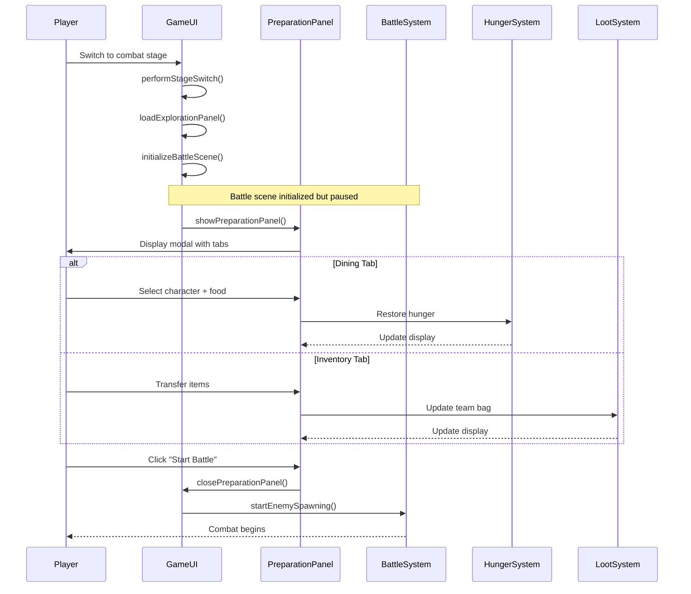

# Design Document - Combat Preparation Panel

## Overview

The Combat Preparation Panel feature introduces a pre-battle preparation phase for combat stages. When players switch to grassland, forest, or cave stages, the game intercepts the stage switch, initializes the battle scene without starting enemy spawning, and displays a modal preparation panel. This panel provides two main functions: feeding party members to restore hunger, and managing team bag inventory. Once preparation is complete, players click "Start Battle" to begin combat.

This design integrates with existing systems including GameUI, BattleSystem, HungerSystem (饱腹度系统), LootSystem (team bag), NPCSystem, and InventorySystem.

## Architecture

### High-Level Flow



### Component Integration

The preparation panel integrates with existing GameUI methods:
- `performStageSwitch()` - Modified to show preparation panel for combat stages
- `initializeBattleScene()` - Modified to defer enemy spawning
- `startEnemySpawning()` - Called after preparation panel closes
- `loadExplorationPanel()` - Called after preparation panel closes

## Components and Interfaces

### PreparationPanel Class

A new UI component class that manages the preparation modal:

```typescript
class PreparationPanel {
  private overlay: HTMLElement;
  private panelContainer: HTMLElement;
  private diningTab: HTMLElement;
  private inventoryTab: HTMLElement;
  private currentTab: 'dining' | 'inventory';
  private gameUI: GameUI;
  private onStartBattle: () => void;
  
  constructor(gameUI: GameUI, onStartBattle: () => void);
  
  // Display the preparation panel
  public show(): void;
  
  // Close the preparation panel
  public close(): void;
  
  // Switch between tabs
  private switchTab(tab: 'dining' | 'inventory'): void;
  
  // Render dining page content
  private renderDiningPage(): void;
  
  // Render inventory management page content
  private renderInventoryPage(): void;
  
  // Handle feeding a character
  private feedCharacter(characterId: string, foodItemId: string): void;
  
  // Handle item transfer to team bag
  private transferToTeamBag(itemId: string, quantity: number): void;
  
  // Handle item transfer from team bag
  private transferFromTeamBag(itemId: string, quantity: number): void;
  
  // Validate party before starting battle
  private validateParty(): boolean;
  
  // Handle start battle button click
  private handleStartBattle(): void;
}
```

### GameUI Modifications

Modify existing GameUI class to integrate preparation panel:

```typescript
class GameUI {
  // Add new property
  private preparationPanel: PreparationPanel | null = null;
  private battlePaused: boolean = false;
  
  // Modified method
  private performStageSwitch(stageId: string): void {
    // ... existing cleanup code ...
    
    this.currentStage = stageId;
    this.battleSystem.setCurrentStage(stageId);
    
    // Clear party slots
    for (let i = 0; i < this.partySlots.length; i++) {
      this.partySlots[i] = null;
    }
    this.refreshPartySlots();
    this.updateBattleSystemPartyMembers();
    
    // ... existing notification and UI update code ...
    
    // Load stage default scene
    this.loadStageDefaultScene();
  }
  
  // Modified method
  private loadExplorationPanel(): void {
    // ... existing party and inventory UI setup ...
    
    // Initialize battle scene but don't start spawning yet
    this.initializeBattleSceneWithoutSpawning();
    
    // Show preparation panel for combat stages
    if (this.isCombatStage(this.currentStage)) {
      this.showPreparationPanel();
    } else {
      // For non-combat stages, start normally
      this.startEnemySpawning();
    }
    
    // ... rest of existing code ...
  }
  
  // New method
  private initializeBattleSceneWithoutSpawning(): void {
    // Same as initializeBattleScene() but without calling:
    // - this.startEnemySpawning()
    // - this.battleSystem.startResourceNodeSpawning()
    // - this.startLootSystemUpdate()
    
    // These will be called after preparation panel closes
  }
  
  // New method
  private showPreparationPanel(): void {
    this.battlePaused = true;
    this.preparationPanel = new PreparationPanel(
      this,
      () => this.onPreparationComplete()
    );
    this.preparationPanel.show();
  }
  
  // New method
  private onPreparationComplete(): void {
    this.battlePaused = false;
    
    // Start combat systems
    this.startEnemySpawning();
    this.battleSystem.startResourceNodeSpawning();
    this.startLootSystemUpdate();
    
    // Cleanup preparation panel
    if (this.preparationPanel) {
      this.preparationPanel = null;
    }
  }
}
```

## Data Models

### Hunger Data Access

The preparation panel accesses hunger data through existing NPCSystem:

```typescript
// Get character hunger value
const character = this.npcSystem.getRecruitedCharacter(characterId);
const hungerComponent = this.world.getComponent(character.entityId, HungerComponentType);
const currentHunger = hungerComponent.current;
const maxHunger = hungerComponent.maximum;

// Update hunger after feeding
hungerComponent.current = Math.min(
  hungerComponent.current + foodItem.hungerRestore,
  hungerComponent.maximum
);
```

### Food Item Properties

Food items in the inventory system should have hunger restoration properties:

```typescript
interface FoodItem {
  id: string;
  name: string;
  type: 'dish' | 'material'; // Dishes and some materials can be food
  hungerRestore?: number; // Amount of hunger restored (e.g., 20, 50)
  // ... other existing properties
}
```

### Team Bag Data Access

The preparation panel accesses team bag through existing LootSystem:

```typescript
// Get team bag inventory
const teamBagInventory = this.lootSystem.getTeamBagInventory();
const currentWeight = this.lootSystem.getTeamBagWeight();
const maxWeight = this.lootSystem.getTeamBagMaxWeight();

// Transfer item to team bag
const canTransfer = this.lootSystem.canAddToTeamBag(itemId, quantity);
if (canTransfer.allowed) {
  this.lootSystem.addToTeamBag(itemId, quantity);
  this.inventorySystem.removeItem(itemId, quantity);
}

// Transfer item from team bag
this.lootSystem.removeFromTeamBag(itemId, quantity);
this.inventorySystem.addItem(itemId, quantity);
```

## Correctness Properties

*A property is a characteristic or behavior that should hold true across all valid executions of a system—essentially, a formal statement about what the system should do. Properties serve as the bridge between human-readable specifications and machine-verifiable correctness guarantees.*

### Property 1: Preparation Panel Display on Combat Stage Switch

*For any* stage switch to a combat stage (grassland, forest, cave), the preparation panel should be displayed before enemy spawning begins.

**Validates: Requirements 1.1, 1.3**

### Property 2: Battle System Pause During Preparation

*For any* time when the preparation panel is visible, the battle system should not spawn enemies or update combat mechanics.

**Validates: Requirements 2.1, 2.2**

### Property 3: Hunger Restoration Bounds

*For any* character and food item, feeding the character should increase hunger by the food's restoration value, capped at the character's maximum hunger, and the resulting hunger value should never exceed maximum.

**Validates: Requirements 4.5, 4.7**

### Property 4: Team Bag Weight Limit Enforcement

*For any* item transfer to team bag, if the transfer would cause total weight to exceed maximum weight, the transfer should be prevented and the team bag contents should remain unchanged.

**Validates: Requirements 5.6**

### Property 5: Inventory Consistency After Feeding

*For any* successful feeding action, the food item quantity in inventory should decrease by exactly 1, and if quantity reaches 0, the item should be removed from inventory.

**Validates: Requirements 4.6**

### Property 6: Tab State Preservation

*For any* tab switch within the preparation panel, when switching back to a previously viewed tab, all data and UI state should be preserved as it was before switching away.

**Validates: Requirements 6.5**

### Property 7: Empty Party Validation

*For any* attempt to start battle, if the party has zero characters, the preparation panel should remain open and display a warning message.

**Validates: Requirements 8.1, 8.2**

### Property 8: Combat Start After Preparation

*For any* successful preparation completion (clicking Start Battle with valid party), the battle system should begin enemy spawning and all combat systems should become active.

**Validates: Requirements 7.2, 7.3**

### Property 9: Data Persistence Through Preparation

*For any* changes made during preparation (hunger updates, inventory transfers), these changes should persist in the game state after the preparation panel closes and throughout the combat session.

**Validates: Requirements 10.1, 10.2, 10.3, 10.5**

## Error Handling

### Validation Errors

1. **Empty Party**: Display warning "编队中没有角色，无法开始战斗" (No characters in party, cannot start battle)
2. **Overweight Team Bag**: Display warning "团队背包负重已满，无法添加更多物品" (Team bag weight full, cannot add more items)
3. **Full Hunger**: Display info "该角色饱腹度已满" (Character hunger already full)
4. **Insufficient Food**: Display warning "背包中没有该食物" (Food not in inventory)

### System Errors

1. **Missing Battle System**: Log error and prevent stage switch if BattleSystem not initialized
2. **Missing Hunger Component**: Log warning and skip hunger display for characters without HungerComponent
3. **Invalid Food Item**: Log warning and prevent feeding if food item doesn't have hungerRestore property

### Recovery Strategies

1. **Panel Close Failure**: Ensure battle systems start even if panel cleanup fails
2. **Data Sync Issues**: Refresh displays after any data modification
3. **Weight Calculation Errors**: Recalculate weight from scratch if inconsistency detected

## Testing Strategy

### Unit Tests

Unit tests should focus on specific examples and edge cases:

1. **Preparation Panel Display**
   - Test panel shows when switching to grassland
   - Test panel shows when switching to forest
   - Test panel shows when switching to cave
   - Test panel does NOT show when switching to village

2. **Tab Switching**
   - Test switching from dining to inventory tab
   - Test switching from inventory to dining tab
   - Test default tab is dining when panel opens

3. **Feeding Mechanics**
   - Test feeding character with hunger at 50/100 with food that restores 30
   - Test feeding character with hunger at 90/100 with food that restores 30 (should cap at 100)
   - Test attempting to feed character with hunger at 100/100 (should be prevented)
   - Test food item removed from inventory after feeding

4. **Team Bag Transfers**
   - Test transferring item when weight allows
   - Test transferring item when weight would exceed limit (should be prevented)
   - Test transferring item from team bag back to inventory
   - Test weight display updates after transfer

5. **Start Battle Validation**
   - Test starting battle with 1 character in party (should succeed)
   - Test starting battle with 0 characters in party (should show warning)
   - Test battle systems start after clicking Start Battle

### Property-Based Tests

Property tests should verify universal properties across all inputs. Each test should run a minimum of 100 iterations.

1. **Property Test: Hunger Bounds**
   - **Feature: combat-preparation-panel, Property 3: Hunger Restoration Bounds**
   - Generate random characters with random current/max hunger
   - Generate random food items with random hungerRestore values
   - Feed character and verify: `0 <= newHunger <= maxHunger`
   - Verify: `newHunger = min(oldHunger + hungerRestore, maxHunger)`

2. **Property Test: Weight Limit Enforcement**
   - **Feature: combat-preparation-panel, Property 4: Team Bag Weight Limit Enforcement**
   - Generate random team bag state with random current weight
   - Generate random items with random weights
   - Attempt transfer and verify: if `currentWeight + itemWeight > maxWeight` then transfer fails and team bag unchanged

3. **Property Test: Inventory Consistency**
   - **Feature: combat-preparation-panel, Property 5: Inventory Consistency After Feeding**
   - Generate random inventory with random food items
   - Feed character and verify: food quantity decreased by 1
   - Verify: if quantity was 1, item removed from inventory

4. **Property Test: Data Persistence**
   - **Feature: combat-preparation-panel, Property 9: Data Persistence Through Preparation**
   - Generate random preparation actions (feeding, transfers)
   - Apply actions and close panel
   - Verify: all changes persisted in game state

### Integration Tests

1. **Full Preparation Flow**
   - Switch to combat stage
   - Verify preparation panel appears
   - Add characters to party
   - Feed characters
   - Transfer items to team bag
   - Click Start Battle
   - Verify battle systems active and enemies spawning

2. **Stage Switch Cycle**
   - Switch from village to grassland (should show panel)
   - Complete preparation and battle
   - Switch back to village (should not show panel)
   - Switch to forest (should show panel again)

### Testing Library

For TypeScript, use **fast-check** for property-based testing:

```typescript
import fc from 'fast-check';

// Example property test
fc.assert(
  fc.property(
    fc.integer({ min: 0, max: 100 }), // current hunger
    fc.integer({ min: 1, max: 100 }), // max hunger
    fc.integer({ min: 1, max: 100 }), // hunger restore
    (currentHunger, maxHunger, hungerRestore) => {
      const newHunger = Math.min(currentHunger + hungerRestore, maxHunger);
      return newHunger >= 0 && newHunger <= maxHunger;
    }
  ),
  { numRuns: 100 }
);
```
