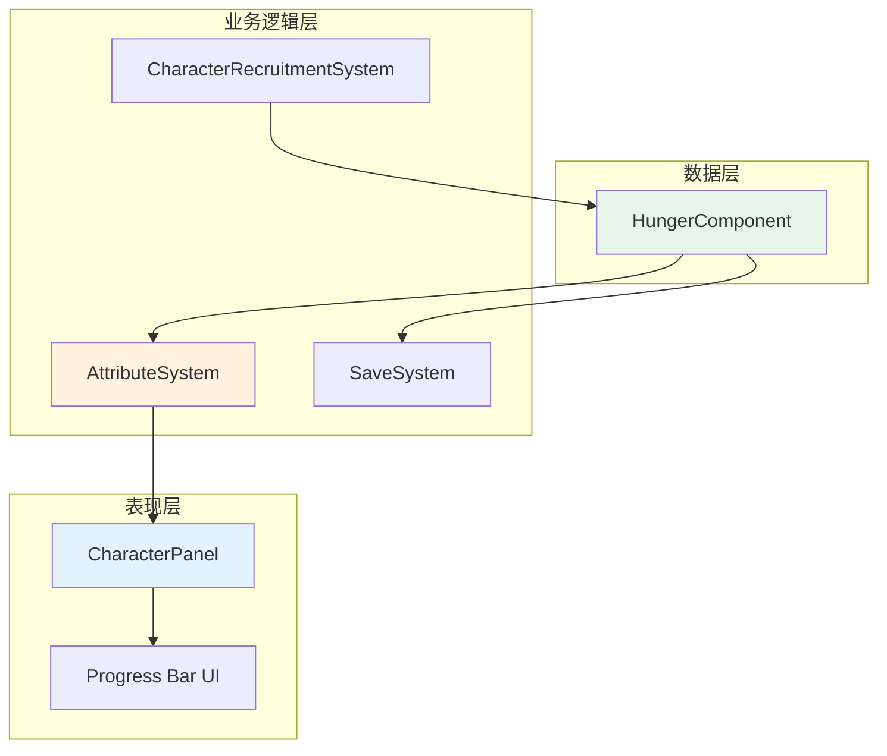

# 设计文档 - 饱腹度系统

## 概述

饱腹度系统为游戏中的所有冒险者角色添加一个新的核心属性"饱腹度"（Hunger）。该系统包括三个主要部分：

1. **数据层**：定义 HungerComponent 组件来存储饱腹度数据
2. **业务逻辑层**：扩展现有的角色创建和属性管理系统以支持饱腹度
3. **表现层**：在 CharacterPanel UI 中添加饱腹度进度条显示

该系统遵循现有的 ECS（Entity-Component-System）架构模式，与 HealthComponent 和 ManaComponent 保持一致的设计风格。

## 架构

### 系统架构图



### 数据流

1. **角色创建流程**：CharacterRecruitmentSystem → 创建 HungerComponent → 初始化为满值
2. **UI 显示流程**：CharacterPanel → 读取 HungerComponent → 渲染进度条
3. **数据持久化流程**：SaveSystem → 序列化 HungerComponent → 存储到存档

## 组件和接口

### HungerComponent

饱腹度组件存储角色的当前和最大饱腹度值。

```typescript
/**
 * Hunger component - current and maximum hunger/satiety
 */
export interface HungerComponent extends Component {
  readonly type: 'hunger';
  current: number;  // 当前饱腹度值 (0 到 maximum)
  maximum: number;  // 最大饱腹度值 (默认 100)
}

export const HungerComponentType = createComponentType<HungerComponent>('hunger');
```

**设计决策**：
- 使用与 HealthComponent 和 ManaComponent 相同的结构（current/maximum 模式）
- maximum 默认值设为 100，便于百分比计算和理解
- current 初始值等于 maximum（满饱腹度状态）

### 组件位置

HungerComponent 将添加到 `src/game/components/CharacterComponents.ts` 文件中，与其他角色属性组件放在一起。

## 数据模型

### 饱腹度数值范围

- **current**: 0 ≤ current ≤ maximum
- **maximum**: maximum > 0（通常为 100）
- **初始状态**: current = maximum = 100

### 数据验证规则

```typescript
// 伪代码：饱腹度值验证
function validateHunger(hunger: HungerComponent): HungerComponent {
  return {
    type: 'hunger',
    current: clamp(hunger.current, 0, hunger.maximum),
    maximum: Math.max(1, hunger.maximum)
  };
}

function clamp(value: number, min: number, max: number): number {
  return Math.max(min, Math.min(max, value));
}
```

## 正确性属性

*属性是一个特征或行为，应该在系统的所有有效执行中保持为真——本质上是关于系统应该做什么的形式化陈述。属性作为人类可读规范和机器可验证正确性保证之间的桥梁。*

### 属性 1：饱腹度值范围不变性

*对于任何* 具有 HungerComponent 的角色实体，其 current 值应始终在 0 到 maximum 之间（包含边界），且 maximum 值应始终大于 0。

**验证：需求 7.1, 7.2, 7.3**

### 属性 2：组件初始化完整性

*对于任何* 新创建的冒险者角色，该角色应具有 HungerComponent，且其 current 值应等于 maximum 值。

**验证：需求 2.1, 2.2, 2.3**

### 属性 3：UI 显示一致性

*对于任何* 在 CharacterPanel 中选中的角色，如果该角色具有 HungerComponent，则面板应显示饱腹度进度条，且进度条的数值应与组件数据一致。

**验证：需求 3.1, 3.5**

### 属性 4：数据持久化往返一致性

*对于任何* 具有 HungerComponent 的角色，保存然后加载游戏数据后，该角色的饱腹度值应保持不变（往返属性）。

**验证：需求 5.1, 5.2**

### 属性 5：进度条位置顺序性

*对于任何* 显示角色详情的 CharacterPanel，饱腹度进度条在 DOM 中的位置应在经验值进度条之后且在好感度显示之前。

**验证：需求 3.2, 3.3**

## 错误处理

### 组件缺失处理

```typescript
// 伪代码：安全获取饱腹度组件
function getHungerSafely(entityId: EntityId, world: World): HungerComponent | null {
  const hunger = world.getComponent<HungerComponent>(entityId, HungerComponentType);
  
  if (!hunger) {
    console.warn(`Entity ${entityId} does not have HungerComponent`);
    return null;
  }
  
  return hunger;
}
```

### 旧存档兼容性

```typescript
// 伪代码：加载时的兼容性处理
function loadCharacterWithHunger(entityId: EntityId, saveData: any, world: World): void {
  // 加载其他组件...
  
  if (saveData.hunger) {
    // 存档中有饱腹度数据
    world.addComponent(entityId, {
      type: 'hunger',
      current: saveData.hunger.current,
      maximum: saveData.hunger.maximum
    });
  } else {
    // 旧存档，初始化默认值
    world.addComponent(entityId, {
      type: 'hunger',
      current: 100,
      maximum: 100
    });
  }
}
```

### UI 渲染错误处理

```typescript
// 伪代码：UI 渲染时的错误处理
function renderHungerBar(character: EntityId, world: World): HTMLElement | null {
  const hunger = getHungerSafely(character, world);
  
  if (!hunger) {
    // 组件不存在，不渲染进度条
    return null;
  }
  
  // 验证数据有效性
  const validatedHunger = validateHunger(hunger);
  
  // 渲染进度条
  return createProgressBar('饱腹度', validatedHunger.current, validatedHunger.maximum);
}
```

## 测试策略

### 单元测试

单元测试用于验证特定示例和边界情况：

1. **组件创建测试**
   - 测试 HungerComponent 的创建和类型定义
   - 测试组件的默认值初始化

2. **数据验证测试**
   - 测试边界值：current = 0, current = maximum
   - 测试无效值的限制：current < 0, current > maximum
   - 测试 maximum = 0 的处理

3. **UI 渲染测试**
   - 测试进度条在特定饱腹度值下的渲染
   - 测试进度条的位置顺序
   - 测试组件缺失时的处理

4. **存档兼容性测试**
   - 测试加载包含饱腹度数据的存档
   - 测试加载不包含饱腹度数据的旧存档

### 属性测试

属性测试用于验证跨所有输入的通用属性，使用属性测试库（如 fast-check）：

**配置**：每个属性测试运行至少 100 次迭代

1. **属性 1：饱腹度值范围不变性**
   - **标签**：Feature: hunger-system, Property 1: 对于任何具有 HungerComponent 的角色实体，其 current 值应始终在 0 到 maximum 之间
   - **测试**：生成随机的 HungerComponent 数据，验证 validateHunger 函数总是返回有效范围内的值

2. **属性 2：组件初始化完整性**
   - **标签**：Feature: hunger-system, Property 2: 对于任何新创建的冒险者角色，该角色应具有 HungerComponent
   - **测试**：生成随机的角色创建参数，验证创建后的角色总是具有 HungerComponent 且 current = maximum

3. **属性 3：UI 显示一致性**
   - **标签**：Feature: hunger-system, Property 3: 对于任何在 CharacterPanel 中选中的角色，进度条的数值应与组件数据一致
   - **测试**：生成随机的饱腹度值，渲染进度条，验证进度条的宽度百分比和文本与数据一致

4. **属性 4：数据持久化往返一致性**
   - **标签**：Feature: hunger-system, Property 4: 保存然后加载游戏数据后，饱腹度值应保持不变
   - **测试**：生成随机的 HungerComponent 数据，序列化后反序列化，验证数据相等

5. **属性 5：进度条位置顺序性**
   - **标签**：Feature: hunger-system, Property 5: 饱腹度进度条在 DOM 中的位置应在经验值之后且在好感度之前
   - **测试**：渲染角色面板，验证饱腹度进度条的 DOM 位置符合要求

### 集成测试

集成测试验证系统各部分的协同工作：

1. **端到端角色创建流程**
   - 创建角色 → 验证 HungerComponent 存在 → 打开 CharacterPanel → 验证进度条显示

2. **存档加载流程**
   - 创建角色并设置饱腹度 → 保存游戏 → 加载游戏 → 验证饱腹度值正确

3. **UI 更新流程**
   - 打开 CharacterPanel → 修改角色饱腹度 → 验证进度条自动更新

## 实现注意事项

### 代码位置

1. **HungerComponent 定义**：`src/game/components/CharacterComponents.ts`
2. **角色创建逻辑**：`src/game/systems/CharacterRecruitmentSystem.ts`
3. **UI 渲染逻辑**：`src/ui/components/CharacterPanel.ts`
4. **存档逻辑**：`src/ecs/SaveSystem.ts`（如果需要特殊处理）

### 样式建议

饱腹度进度条建议使用以下颜色方案：
- **主色调**：`#f39c12`（橙色）或 `#d35400`（深橙色/棕色）
- **背景**：`rgba(0,0,0,0.3)`（与其他进度条一致）
- **文本**：白色，带阴影

### 性能考虑

- UI 更新应使用事件驱动机制，避免每帧轮询
- 进度条宽度变化使用 CSS transition 实现平滑动画
- 组件数据访问应缓存，避免重复查询

### 扩展性

该设计为未来的饱腹度相关功能预留了扩展空间：
- 饱腹度消耗系统（随时间减少）
- 饱腹度对角色属性的影响（如低饱腹度降低战斗力）
- 食物系统与饱腹度的交互
- 饱腹度状态效果（饥饿、饱腹等）
