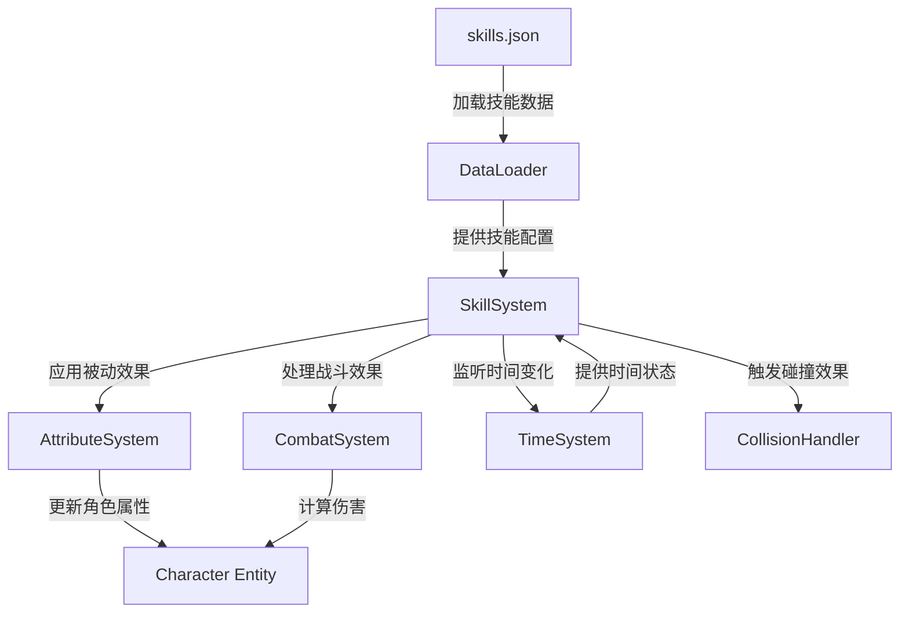
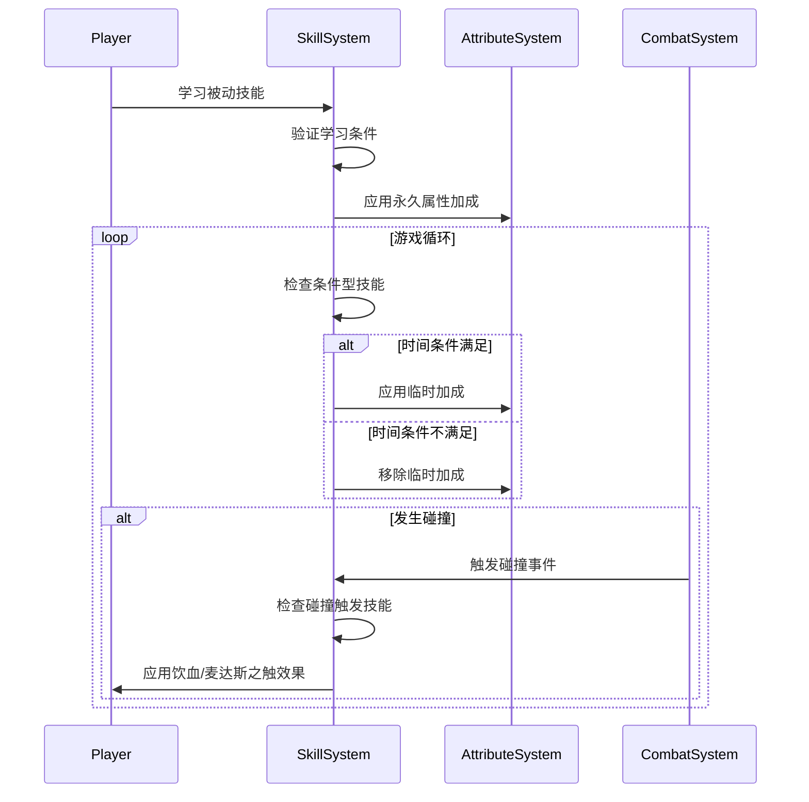

# Design Document: Passive Skills Expansion

## Overview

本设计文档描述了如何在现有游戏系统中添加12个新的被动技能。这些技能将通过扩展现有的技能数据文件（skills.json）来实现，并利用现有的SkillSystem来处理技能效果的应用和管理。

新技能涵盖多个类别：
- 攻击增强型：瞄准弱点、残忍至极、挑战者
- 魔法增强型：奥术至尊
- 资源采集型：自然学
- 经济收益型：麦达斯之触
- 体型调整型：泰坦血脉、搬运者
- 生命恢复型：饮血
- 时间依赖型：月之祝福、光合作用
- 饱腹度管理型：胃炎

## Architecture

### 系统组件关系



### 技能效果应用流程



## Components and Interfaces

### 1. 技能数据结构

所有新技能将遵循现有的技能数据结构：

```typescript
interface SkillData {
  id: string;                    // 技能唯一标识符
  name: string;                  // 技能名称（中文）
  description: string;           // 技能描述
  type: 'passive';               // 技能类型（所有新技能都是被动）
  maxLevel: number;              // 最大等级
  manaCost: number;              // 魔法消耗（被动技能为0）
  cooldown: number;              // 冷却时间（被动技能为0）
  icon: string;                  // 图标路径
  effects: SkillEffect[];        // 技能效果数组
  learnConditions: LearnCondition[]; // 学习条件
}

interface SkillEffect {
  type: string;                  // 效果类型
  target: string;                // 目标（self/enemy/resource等）
  attribute: string;             // 影响的属性
  value: number;                 // 效果数值
  duration: number;              // 持续时间（-1表示永久）
  condition?: TimeCondition;     // 可选的条件（用于时间依赖技能）
}

interface TimeCondition {
  type: 'time_of_day';
  value: 'day' | 'night';
}
```

### 2. 新增效果类型

为了支持新技能，需要定义以下效果类型：

```typescript
type EffectType = 
  | 'attribute_bonus'        // 属性加成（现有）
  | 'conditional_bonus'      // 条件加成（新增，用于时间依赖）
  | 'on_collision_heal'      // 碰撞治疗（新增，用于饮血）
  | 'on_collision_gold'      // 碰撞获得金币（新增，用于麦达斯之触）
  | 'damage_modifier'        // 伤害修正（新增，用于挑战者、自然学）
  | 'percentage_modifier';   // 百分比修正（新增，用于搬运者的速度减少）
```

### 3. SkillSystem扩展

SkillSystem需要扩展以支持新的效果类型：

```typescript
class SkillSystem extends System {
  // 现有方法...
  
  // 新增：处理条件型被动技能
  private updateConditionalPassiveSkills(currentTime: TimeOfDay): void {
    // 遍历所有角色的被动技能
    // 检查时间条件
    // 应用或移除条件加成
  }
  
  // 新增：处理碰撞触发效果
  private handleCollisionEffects(
    attackerId: EntityId, 
    targetId: EntityId, 
    damage: number
  ): void {
    // 检查攻击者的被动技能
    // 应用饮血效果（治疗）
    // 应用麦达斯之触效果（金币）
  }
  
  // 新增：计算伤害修正
  public getDamageModifier(
    attackerId: EntityId, 
    targetType: 'normal' | 'boss' | 'resource'
  ): number {
    // 检查攻击者的被动技能
    // 返回伤害修正倍率
  }
}
```

### 4. CombatSystem集成

CombatSystem需要在计算伤害时调用SkillSystem：

```typescript
class CombatSystem extends System {
  private calculateDamage(
    attackerId: EntityId, 
    targetId: EntityId, 
    baseDamage: number
  ): number {
    let finalDamage = baseDamage;
    
    // 获取目标类型
    const targetType = this.getTargetType(targetId);
    
    // 应用技能伤害修正
    const modifier = this.skillSystem.getDamageModifier(attackerId, targetType);
    finalDamage *= modifier;
    
    // 应用暴击
    const critRate = this.getAttribute(attackerId, 'critRate');
    const critDamage = this.getAttribute(attackerId, 'critDamage');
    if (Math.random() < critRate) {
      finalDamage *= (1 + critDamage);
    }
    
    // 触发碰撞效果
    this.skillSystem.handleCollisionEffects(attackerId, targetId, finalDamage);
    
    return finalDamage;
  }
}
```

## Data Models

### 技能数据示例

#### 1. 瞄准弱点（Aim Weakness）
```json
{
  "id": "aim_weakness",
  "name": "瞄准弱点",
  "description": "精准地瞄准敌人的弱点，增加8%暴击率。",
  "type": "passive",
  "maxLevel": 1,
  "manaCost": 0,
  "cooldown": 0,
  "icon": "images/beidongjineng_miaozhunruodian.png",
  "effects": [
    {
      "type": "attribute_bonus",
      "target": "self",
      "attribute": "critRate",
      "value": 0.08,
      "duration": -1
    }
  ],
  "learnConditions": [
    {
      "type": "level",
      "value": 1,
      "description": "需要角色等级1"
    }
  ]
}
```

#### 2. 月之祝福（Moon Blessing）
```json
{
  "id": "moon_blessing",
  "name": "月之祝福",
  "description": "在夜晚获得月亮的祝福，攻击力+15%，防御力+10。",
  "type": "passive",
  "maxLevel": 1,
  "manaCost": 0,
  "cooldown": 0,
  "icon": "images/beidongjineng_yuezhizhufu.png",
  "effects": [
    {
      "type": "conditional_bonus",
      "target": "self",
      "attribute": "attack",
      "value": 0.15,
      "duration": -1,
      "condition": {
        "type": "time_of_day",
        "value": "night"
      }
    },
    {
      "type": "conditional_bonus",
      "target": "self",
      "attribute": "defense",
      "value": 10,
      "duration": -1,
      "condition": {
        "type": "time_of_day",
        "value": "night"
      }
    }
  ],
  "learnConditions": [
    {
      "type": "level",
      "value": 1,
      "description": "需要角色等级1"
    }
  ]
}
```

#### 3. 饮血（Lifesteal）
```json
{
  "id": "lifesteal",
  "name": "饮血",
  "description": "每次对敌人造成碰撞伤害后，恢复相当于伤害10%的生命值。",
  "type": "passive",
  "maxLevel": 1,
  "manaCost": 0,
  "cooldown": 0,
  "icon": "images/beidongjineng_yinxue.png",
  "effects": [
    {
      "type": "on_collision_heal",
      "target": "self",
      "attribute": "health",
      "value": 0.1,
      "duration": -1
    }
  ],
  "learnConditions": [
    {
      "type": "level",
      "value": 1,
      "description": "需要角色等级1"
    }
  ]
}
```

#### 4. 麦达斯之触（Midas Touch）
```json
{
  "id": "midas_touch",
  "name": "麦达斯之触",
  "description": "每次碰撞到敌人后，获得1~3金币。",
  "type": "passive",
  "maxLevel": 1,
  "manaCost": 0,
  "cooldown": 0,
  "icon": "images/beidongjineng_maidasizhichu.png",
  "effects": [
    {
      "type": "on_collision_gold",
      "target": "self",
      "attribute": "gold",
      "value": 2,
      "duration": -1,
      "minValue": 1,
      "maxValue": 3
    }
  ],
  "learnConditions": [
    {
      "type": "level",
      "value": 1,
      "description": "需要角色等级1"
    }
  ]
}
```

### 完整技能列表

所有12个新技能的完整数据将添加到skills.json文件中：

1. **aim_weakness** - 瞄准弱点：暴击率+8%
2. **extreme_cruelty** - 残忍至极：暴伤+10%
3. **natural_science** - 自然学：对资源点伤害+100%
4. **titan_bloodline** - 泰坦血脉：体积+30，体重+10
5. **carrier** - 搬运者：负重+30，移速-30%
6. **arcane_supremacy** - 奥术至尊：魔法强度+8
7. **lifesteal** - 饮血：碰撞伤害的10%转化为治疗
8. **moon_blessing** - 月之祝福：夜晚攻击+15%，防御+10
9. **gastritis** - 胃炎：最大生命-10，饱腹度消耗-50%
10. **midas_touch** - 麦达斯之触：碰撞获得1~3金币
11. **challenger** - 挑战者：对BOSS伤害+15%
12. **photosynthesis** - 光合作用：白天回血+1，回魔+1

## Correctness Properties

*属性（Property）是关于系统行为的形式化陈述，应该在所有有效执行中保持为真。属性是人类可读规范和机器可验证正确性保证之间的桥梁。*


### Property 1: 所有新技能存在于数据文件中
*For all* 12个新技能ID（aim_weakness, extreme_cruelty, natural_science, titan_bloodline, carrier, arcane_supremacy, lifesteal, moon_blessing, gastritis, midas_touch, challenger, photosynthesis），技能数据文件应该包含对应的技能条目
**Validates: Requirements 1.1, 1.3, 1.5, 2.1, 3.1, 4.1, 5.1, 5.4, 6.1, 7.1, 7.5, 8.1**

### Property 2: 技能数据结构完整性
*For all* 新添加的被动技能，每个技能应该包含所有必需字段（id, name, description, type, maxLevel, manaCost, cooldown, icon, effects, learnConditions），且type为"passive"，manaCost为0，cooldown为0，effects数组非空
**Validates: Requirements 9.1, 9.2, 9.3, 9.4, 9.5, 10.1**

### Property 3: 技能ID唯一性
*For all* 技能数据文件中的技能，不应该存在两个技能具有相同的id
**Validates: Requirements 13.1**

### Property 4: 永久属性加成正确应用
*For any* 角色和任意永久属性加成技能（瞄准弱点、残忍至极、奥术至尊、泰坦血脉、搬运者、胃炎），当角色学习该技能后，对应的属性值应该按照技能定义的数值增加或减少
**Validates: Requirements 1.2, 1.4, 2.2, 5.2, 5.3, 5.5, 5.6, 8.2, 8.3**

### Property 5: BOSS伤害加成正确计算
*For any* 拥有"挑战者"技能的角色和任意BOSS敌人，角色对该BOSS造成的伤害应该是基础伤害的115%（1.15倍）
**Validates: Requirements 1.6**

### Property 6: 资源点伤害加成正确计算
*For any* 拥有"自然学"技能的角色和任意资源点，角色对该资源点造成的伤害应该是基础伤害的200%（2倍）
**Validates: Requirements 3.2**

### Property 7: 饮血效果正确应用
*For any* 拥有"饮血"技能的角色，当该角色对敌人造成碰撞伤害后，角色应该立即恢复相当于该次伤害10%的生命值
**Validates: Requirements 6.2, 6.3, 6.4**

### Property 8: 麦达斯之触金币奖励
*For any* 拥有"麦达斯之触"技能的角色，当该角色对敌人造成碰撞伤害后，角色应该获得1到3枚金币（包含1和3）
**Validates: Requirements 4.2, 4.3**

### Property 9: 月之祝福夜晚效果
*For any* 拥有"月之祝福"技能的角色，当游戏时间为夜晚时，角色的攻击力应该增加15%，防御力应该增加10；当游戏时间为白天时，这些加成应该被移除
**Validates: Requirements 7.2, 7.3, 7.4**

### Property 10: 光合作用白天效果
*For any* 拥有"光合作用"技能的角色，当游戏时间为白天时，角色的生命恢复速度应该增加1/tick，魔法恢复速度应该增加1/tick；当游戏时间为夜晚时，这些加成应该被移除
**Validates: Requirements 7.6, 7.7, 7.8**

### Property 11: 效果对象结构完整性
*For all* 新技能的效果对象，每个效果应该包含type、target、attribute、value和duration字段
**Validates: Requirements 9.6**

### Property 12: 永久效果持续时间标记
*For all* 新技能中的永久效果，duration字段应该设置为-1
**Validates: Requirements 9.7**

### Property 13: 图标路径格式正确
*For all* 新技能的图标路径，应该以"images/"开头并以".png"结尾
**Validates: Requirements 10.2**

### Property 14: 描述包含数值信息
*For all* 新技能，技能描述中应该包含该技能效果的具体数值
**Validates: Requirements 11.2**

### Property 15: 系统支持所需效果类型
*For all* 新技能使用的效果类型（attribute_bonus, conditional_bonus, on_collision_heal, on_collision_gold, damage_modifier），SkillSystem应该能够正确处理和应用这些效果
**Validates: Requirements 12.1, 12.2, 12.3, 12.4**

## Error Handling

### 数据加载错误

1. **技能数据格式错误**
   - 检测：在DataLoader加载skills.json时验证JSON格式
   - 处理：记录错误日志，跳过格式错误的技能条目，继续加载其他技能
   - 用户反馈：在控制台输出警告信息

2. **必需字段缺失**
   - 检测：验证每个技能是否包含所有必需字段
   - 处理：记录错误日志，使用默认值填充缺失字段（如果可能），或跳过该技能
   - 用户反馈：在开发模式下显示警告

3. **图标文件不存在**
   - 检测：在加载技能数据后验证图标文件路径
   - 处理：使用默认占位符图标
   - 用户反馈：在控制台输出警告信息

### 技能应用错误

1. **属性不存在**
   - 检测：在应用技能效果时检查目标属性是否存在于角色组件中
   - 处理：记录错误日志，跳过该效果的应用
   - 用户反馈：在开发模式下显示错误信息

2. **时间系统未初始化**
   - 检测：在应用条件型技能时检查TimeSystem是否可用
   - 处理：暂时跳过条件检查，将技能效果视为永久效果
   - 用户反馈：在控制台输出警告信息

3. **碰撞事件处理失败**
   - 检测：在碰撞事件处理器中捕获异常
   - 处理：记录错误日志，继续处理其他碰撞效果
   - 用户反馈：不影响游戏正常进行

### 边界情况

1. **负数属性值**
   - 某些技能会减少属性（如胃炎减少最大生命值）
   - 确保属性值不会变为负数（除非该属性允许负值）
   - 对于生命值等关键属性，设置最小值限制

2. **百分比计算精度**
   - 使用浮点数进行百分比计算时可能出现精度问题
   - 在最终应用时进行四舍五入或向下取整
   - 确保显示给玩家的数值与实际计算一致

3. **时间切换边界**
   - 在昼夜切换的瞬间，确保条件型技能效果正确切换
   - 使用事件驱动机制而非轮询检查，避免遗漏切换时刻

## Testing Strategy

### 单元测试（Unit Tests）

单元测试用于验证具体的实现细节和边界情况：

1. **数据加载测试**
   - 测试skills.json文件能够正确加载
   - 测试所有12个新技能都存在于数据文件中
   - 测试技能数据结构的完整性

2. **技能效果应用测试**
   - 测试每个技能的效果能够正确应用到角色属性
   - 测试技能效果的数值计算正确性
   - 测试技能效果的叠加和移除

3. **边界情况测试**
   - 测试属性值为0时的技能效果
   - 测试属性值达到上限时的技能效果
   - 测试昼夜切换边界时刻的技能效果

4. **错误处理测试**
   - 测试缺失必需字段时的处理
   - 测试图标文件不存在时的处理
   - 测试无效效果类型时的处理

### 属性测试（Property-Based Tests）

属性测试用于验证系统在各种输入下的通用正确性，每个测试至少运行100次迭代：

1. **技能数据完整性测试**
   - 生成：随机选择新技能
   - 验证：技能包含所有必需字段且格式正确
   - 标签：**Feature: passive-skills-expansion, Property 2: 技能数据结构完整性**

2. **永久属性加成测试**
   - 生成：随机角色和随机永久属性加成技能
   - 验证：学习技能后属性值正确变化
   - 标签：**Feature: passive-skills-expansion, Property 4: 永久属性加成正确应用**

3. **伤害修正测试**
   - 生成：随机角色、随机基础伤害、随机目标类型
   - 验证：拥有对应技能时伤害修正正确
   - 标签：**Feature: passive-skills-expansion, Property 5: BOSS伤害加成正确计算** 和 **Property 6: 资源点伤害加成正确计算**

4. **碰撞触发效果测试**
   - 生成：随机角色、随机碰撞伤害
   - 验证：饮血和麦达斯之触效果正确触发
   - 标签：**Feature: passive-skills-expansion, Property 7: 饮血效果正确应用** 和 **Property 8: 麦达斯之触金币奖励**

5. **时间条件效果测试**
   - 生成：随机角色、随机时间状态
   - 验证：月之祝福和光合作用在正确时间段生效
   - 标签：**Feature: passive-skills-expansion, Property 9: 月之祝福夜晚效果** 和 **Property 10: 光合作用白天效果**

6. **数据结构验证测试**
   - 生成：遍历所有新技能
   - 验证：效果对象结构完整，永久效果duration为-1
   - 标签：**Feature: passive-skills-expansion, Property 11: 效果对象结构完整性** 和 **Property 12: 永久效果持续时间标记**

### 集成测试

1. **技能系统集成测试**
   - 测试SkillSystem与AttributeSystem的集成
   - 测试SkillSystem与CombatSystem的集成
   - 测试SkillSystem与TimeSystem的集成

2. **完整游戏流程测试**
   - 测试角色学习技能的完整流程
   - 测试技能效果在战斗中的表现
   - 测试技能效果在昼夜切换时的表现

### 测试工具和框架

- **单元测试框架**：Vitest（项目已使用）
- **属性测试库**：fast-check（TypeScript的属性测试库）
- **测试配置**：每个属性测试至少100次迭代
- **覆盖率目标**：核心功能代码覆盖率达到90%以上

## Implementation Notes

### 实现优先级

1. **Phase 1: 数据添加**（最高优先级）
   - 在skills.json中添加所有12个新技能的数据
   - 确保数据结构完整且格式正确
   - 添加技能图标文件引用

2. **Phase 2: 基础效果支持**
   - 实现attribute_bonus效果类型（如果尚未支持）
   - 测试永久属性加成技能（瞄准弱点、残忍至极等）

3. **Phase 3: 条件效果支持**
   - 实现conditional_bonus效果类型
   - 集成TimeSystem进行时间条件检查
   - 测试时间依赖技能（月之祝福、光合作用）

4. **Phase 4: 碰撞效果支持**
   - 实现on_collision_heal和on_collision_gold效果类型
   - 在CombatSystem中添加碰撞事件处理
   - 测试碰撞触发技能（饮血、麦达斯之触）

5. **Phase 5: 伤害修正支持**
   - 实现damage_modifier效果类型
   - 在CombatSystem中添加目标类型识别
   - 测试伤害修正技能（挑战者、自然学）

### 向后兼容性

- 所有新增的效果类型都是可选的，不会影响现有技能的功能
- 如果某个效果类型不被支持，系统应该优雅地跳过该效果并记录警告
- 现有的技能数据结构保持不变

### 性能考虑

- 条件型技能的检查应该在时间状态变化时触发，而不是每帧检查
- 碰撞效果的处理应该在碰撞事件中进行，避免额外的遍历
- 技能数据应该在游戏启动时一次性加载，避免运行时的文件IO

### 可扩展性

- 效果类型系统设计为可扩展的，未来可以轻松添加新的效果类型
- 条件系统可以扩展支持更多条件类型（如天气、位置等）
- 技能数据格式支持多个效果，可以创建更复杂的技能组合
