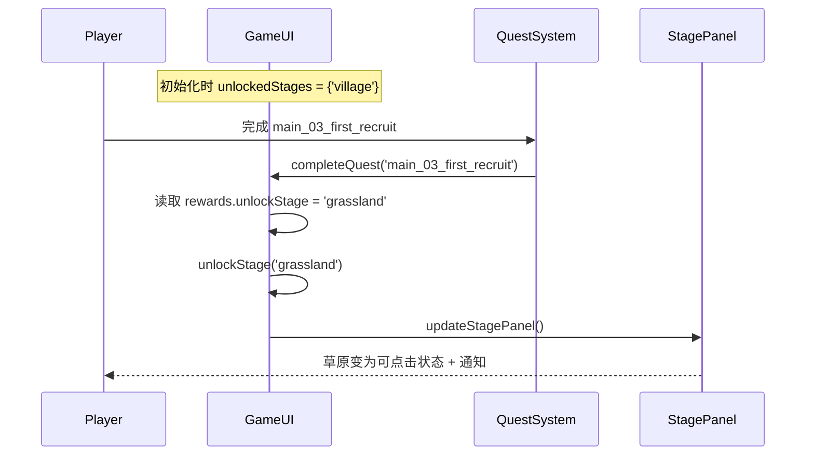

# 设计文档

## 概述

本功能通过两处最小改动实现任务驱动的关卡解锁：
1. 修改 `quests.json` 中主线任务3的奖励，添加 `unlockStage: "grassland"`
2. 修改 `GameUI.ts` 中 `unlockedStages` 的初始值，移除 `'grassland'`
3. 扩展 `QuestSaveData` 接口以持久化已解锁关卡

现有的 `completeQuest` → `unlockStage` 调用链已经完整实现，无需修改奖励处理逻辑。

## 架构



改动范围极小，核心逻辑已存在，只需修改数据和初始状态。

## 组件与接口

### 受影响的文件

1. **`src/game/data/quests.json`** — 修改 `main_03_first_recruit` 的 rewards
2. **`src/ui/GameUI.ts`** — 修改 `unlockedStages` 初始值
3. **`src/game/data/quest-types.ts`** — 扩展 `QuestSaveData` 接口

### 现有接口（无需修改）

```typescript
// quest-types.ts - QuestReward 已支持 unlockStage
interface QuestReward {
  gold?: number;
  crystal?: number;
  items?: Array<{ itemId: string; quantity: number }>;
  unlockNpc?: string;
  unlockStage?: string;  // 已存在
}

// GameUI.ts - unlockStage 方法已存在
private unlockStage(stageId: string): void;

// GameUI.ts - completeQuest 已处理 unlockStage 奖励
private completeQuest(questId: string, onUpdate?: () => void): void;
```

### 需要修改的接口

```typescript
// quest-types.ts - QuestSaveData 需要扩展
interface QuestSaveData {
  questStates: Record<string, QuestState>;
  lastDailyReset: number;
  unlockedStages?: string[];  // 新增：已解锁关卡列表
}
```

## 数据模型

### quests.json 变更

```json
// main_03_first_recruit 的 rewards 从：
{ "gold": 300 }
// 改为：
{ "gold": 300, "unlockStage": "grassland" }
```

### GameUI.ts 初始状态变更

```typescript
// 从：
private unlockedStages: Set<string> = new Set(['village', 'grassland']);
// 改为：
private unlockedStages: Set<string> = new Set(['village']);
```

### 存档数据兼容性

对于不包含 `unlockedStages` 字段的旧存档，反序列化时需要从已完成任务的奖励中推导出已解锁关卡：

```typescript
// 反序列化时的兼容逻辑
if (!data.unlockedStages) {
  // 始终包含 village
  this.unlockedStages = new Set(['village']);
  // 遍历已完成任务，恢复 unlockStage 奖励
  for (const [questId, state] of this.questStates) {
    if (state.status === 'completed') {
      const def = this.questDefinitions.find(q => q.id === questId);
      if (def?.rewards.unlockStage) {
        this.unlockedStages.add(def.rewards.unlockStage);
      }
    }
  }
} else {
  this.unlockedStages = new Set(data.unlockedStages);
}
```


## 正确性属性

*属性是系统在所有有效执行中应保持为真的特征或行为——本质上是关于系统应该做什么的形式化陈述。属性是人类可读规范与机器可验证正确性保证之间的桥梁。*

### Property 1: 任务完成解锁关卡

*For any* quest definition that includes an `unlockStage` reward, when that quest is completed, the corresponding stage ID should be present in the `unlockedStages` set.

**Validates: Requirements 2.2, 2.3**

### Property 2: 已解锁关卡序列化/反序列化往返一致性

*For any* set of unlocked stage IDs, serializing the game state and then deserializing it should produce an identical set of unlocked stages.

**Validates: Requirements 3.2, 3.3**

### Property 3: 旧存档兼容性——从已完成任务推导解锁关卡

*For any* set of completed quests (each with optional `unlockStage` rewards), when deserializing save data that lacks the `unlockedStages` field, the derived unlocked stages should equal the union of `{'village'}` and all `unlockStage` values from completed quest rewards.

**Validates: Requirements 3.4**

## 错误处理

| 场景 | 处理方式 |
|------|---------|
| `unlockStage` 指定了不存在的关卡ID | `unlockStage` 方法仍会添加到集合中，`updateStagePanel` 中的关卡列表是硬编码的，不会显示未知关卡 |
| 重复解锁同一关卡 | `unlockStage` 方法已有 `if (this.unlockedStages.has(stageId)) return` 守卫 |
| 旧存档无 `unlockedStages` 字段 | 从已完成任务的 `unlockStage` 奖励推导，确保向后兼容 |

## 测试策略

### 单元测试

- 验证 `quests.json` 中 `main_03_first_recruit` 的 rewards 包含 `unlockStage: "grassland"`
- 验证 `main_04_explore_grassland` 的 prerequisites 包含 `main_03_first_recruit`
- 验证初始 `unlockedStages` 仅包含 `'village'`

### 属性测试

使用 `fast-check` 库（vitest 项目中常用的属性测试库）：

- 每个属性测试至少运行 100 次迭代
- 每个测试用注释标注对应的设计文档属性编号
- 标签格式：**Feature: quest-stage-unlock, Property {number}: {property_text}**

测试文件：`src/ui/GameUI.quest-stage-unlock.property.test.ts`

属性测试覆盖：
1. Property 1：生成随机任务定义（含/不含 unlockStage），验证完成后关卡集合状态
2. Property 2：生成随机关卡ID集合，验证序列化→反序列化往返一致性
3. Property 3：生成随机已完成任务集合，验证旧存档兼容逻辑推导结果
