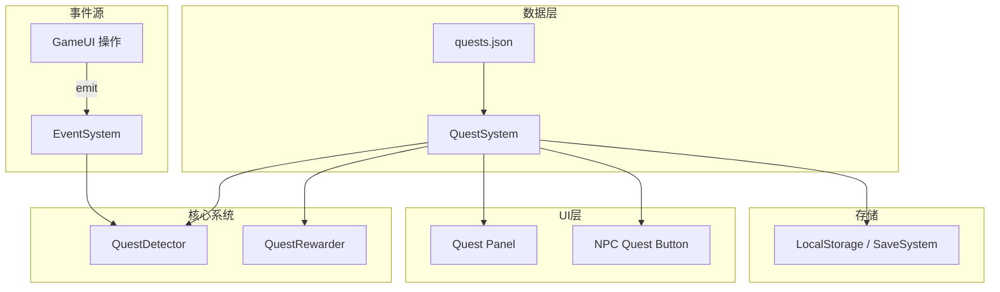

# 设计文档：任务系统（Quest System）

## 概述

任务系统为「代号：饭」新增主线任务、支线任务和日常任务三种任务类型。系统采用数据驱动设计，任务定义存储在 `quests.json` 中，通过事件驱动的检测系统自动追踪任务进度。系统集成到现有的 `GameUI` 类中，复用已有的 `EventSystem`、`CurrencySystem`、`ItemSystem` 等基础设施。

核心设计决策：
- 任务数据与逻辑分离，所有任务定义在 JSON 文件中
- 通过 EventSystem 订阅游戏事件实现自动检测，避免轮询
- 任务面板从全局视图改为 NPC 过滤视图，每个 NPC 显示自己相关的任务
- 日常任务重置挂载到现有的 `onDawnEvents()` 方法

## 架构



事件流：
1. 玩家执行操作（拾取物品、切换场景、制作等）
2. GameUI 通过 EventSystem 发出事件
3. QuestDetector 监听事件，更新匹配的任务进度
4. 进度变化触发 UI 更新（红点、进度显示）
5. 主线任务自动完成；支线/日常任务需玩家手动点击完成按钮

## 组件与接口

### QuestSystem 类

在 `GameUI` 中作为内部模块实现（与现有架构一致，不创建独立的 System 类）。

```typescript
// src/game/data/quest-types.ts

/** 任务目标检测类型 */
type QuestObjectiveType = 
  | 'item_possession'    // 持有物品
  | 'scene_visit'        // 访问场景
  | 'craft_item'         // 制作物品
  | 'combat_complete'    // 完成战斗
  | 'recruit'            // 招募冒险者
  | 'gift_give'          // 送礼
  | 'affinity_level';    // 好感度等级

/** 单个任务目标 */
interface QuestObjective {
  type: QuestObjectiveType;
  target: string;          // 目标ID（物品ID、场景ID、NPC ID等）
  requiredAmount: number;  // 需要数量
  currentAmount: number;   // 当前进度
  description: string;     // 目标描述文本
}

/** 任务奖励 */
interface QuestReward {
  gold?: number;
  crystal?: number;
  items?: Array<{ itemId: string; quantity: number }>;
  unlockNpc?: string;      // 解锁NPC的ID
  unlockStage?: string;    // 解锁关卡的ID
}

/** 任务类型 */
type QuestType = 'main' | 'side' | 'daily';

/** 任务状态 */
type QuestStatus = 'locked' | 'available' | 'inProgress' | 'completed';

/** 任务定义（JSON中的数据） */
interface QuestDefinition {
  id: string;
  name: string;
  description: string;
  type: QuestType;
  npcId: string;           // 关联NPC
  objectives: QuestObjective[];
  rewards: QuestReward;
  prerequisites: string[]; // 前置任务ID列表
  sortOrder: number;       // 排序权重
}

/** 运行时任务状态 */
interface QuestState {
  id: string;
  status: QuestStatus;
  objectives: Array<{
    currentAmount: number;
  }>;
  completedAt?: number;    // 完成时间戳（用于日常任务重置判断）
}
```

### 核心方法

```typescript
// 在 GameUI 中新增的方法

// 初始化
private async loadQuestData(): Promise<void>;       // 加载 quests.json
private initQuestSystem(): void;                     // 初始化任务状态，检查前置条件

// 任务状态管理
private getQuestsForNpc(npcId: string): QuestDefinition[];  // 获取NPC相关任务
private acceptQuest(questId: string): void;                   // 接受任务
private completeQuest(questId: string): void;                 // 完成任务（重写现有方法）
private isQuestAvailable(quest: QuestDefinition): boolean;    // 检查任务是否可接

// 检测系统
private setupQuestDetection(): void;                 // 注册事件监听
private checkQuestProgress(type: QuestObjectiveType, target: string, amount?: number): void;
private checkMainQuestAutoComplete(): void;          // 检查主线任务自动完成

// 日常任务
private resetDailyQuests(): void;                    // 重置日常任务（在onDawnEvents中调用）

// UI
private showQuestPanel(npcId?: string): void;        // 显示任务面板（可选NPC过滤）
private updateQuestRedDots(): void;                  // 更新红点（重写现有方法）

// 持久化
private serializeQuestState(): any;                  // 序列化任务状态
private deserializeQuestState(data: any): void;      // 反序列化任务状态
```

### 事件检测映射

| 游戏事件 | 检测类型 | 触发位置 |
|---------|---------|---------|
| 物品添加到背包 | `item_possession` | `itemSystem.addItem()` 调用后 emit `quest:item_gained` |
| 切换场景 | `scene_visit` | `switchScene()` 中 emit `quest:scene_visited` |
| 完成烹饪 | `craft_item` | `completeCooking()` 中 emit `quest:craft_completed` |
| 完成装备制作 | `craft_item` | `completeEquipmentCrafting()` 中 emit `quest:craft_completed` |
| 完成炼金 | `craft_item` | `completeAlchemyCrafting()` 中 emit `quest:craft_completed` |
| 战斗胜利 | `combat_complete` | 战斗结束时 emit `quest:combat_completed` |
| 招募冒险者 | `recruit` | `handleRecruitClick()` 中 emit `quest:recruited` |
| 送礼 | `gift_give` | `handleGiftClick()` 中 emit `quest:gift_given` |
| 好感度变化 | `affinity_level` | `updateAffinity()` 后 emit `quest:affinity_changed` |

## 数据模型

### quests.json 结构

```json
{
  "mainQuests": [
    {
      "id": "main_01_meet_chief",
      "name": "初来乍到",
      "description": "与村长对话，了解村庄的基本情况",
      "type": "main",
      "npcId": "village_chief",
      "objectives": [
        {
          "type": "scene_visit",
          "target": "square",
          "requiredAmount": 1,
          "currentAmount": 0,
          "description": "前往广场拜访村长"
        }
      ],
      "rewards": { "gold": 100 },
      "prerequisites": [],
      "sortOrder": 1
    }
  ],
  "sideQuests": [
    {
      "id": "side_blacksmith_01",
      "name": "铁匠的考验",
      "description": "为铁匠制作一把铜长剑",
      "type": "side",
      "npcId": "blacksmith_zz",
      "objectives": [
        {
          "type": "craft_item",
          "target": "copper_longsword",
          "requiredAmount": 1,
          "currentAmount": 0,
          "description": "制作铜长剑 x1"
        }
      ],
      "rewards": { "gold": 500, "items": [{ "itemId": "copper_ore", "quantity": 10 }] },
      "prerequisites": [],
      "sortOrder": 1
    }
  ],
  "dailyQuests": [
    {
      "id": "daily_blacksmith_01",
      "name": "日常锻造",
      "description": "制作任意一件装备",
      "type": "daily",
      "npcId": "blacksmith_zz",
      "objectives": [
        {
          "type": "craft_item",
          "target": "any_equipment",
          "requiredAmount": 1,
          "currentAmount": 0,
          "description": "制作任意装备 x1"
        }
      ],
      "rewards": { "gold": 200 },
      "prerequisites": [],
      "sortOrder": 1
    }
  ]
}
```

### 任务状态存储（localStorage）

```typescript
interface QuestSaveData {
  questStates: Record<string, QuestState>;  // questId -> QuestState
  lastDailyReset: number;                    // 上次日常重置时间戳
}
```


## 正确性属性（Correctness Properties）

*属性是一种在系统所有有效执行中都应成立的特征或行为——本质上是关于系统应该做什么的形式化陈述。属性是人类可读规范与机器可验证正确性保证之间的桥梁。*

Property 1: 任务数据结构完整性
*For any* quest definition loaded from quests.json, the quest object SHALL contain all required fields: id, name, description, type, npcId, objectives (non-empty array), rewards, prerequisites, and sortOrder
**Validates: Requirements 1.1**

Property 2: 目标独立追踪
*For any* quest with multiple objectives, updating progress on one objective (by triggering its detection type) SHALL NOT change the currentAmount of any other objective in the same quest
**Validates: Requirements 1.4**

Property 3: 奖励发放正确性
*For any* completed quest with rewards, the reward granting function SHALL increase the player's gold by the specified gold amount, increase crystal by the specified crystal amount, and add each specified item with the correct quantity to the inventory
**Validates: Requirements 1.5, 7.1, 7.2, 7.3**

Property 4: 主线任务链推进
*For any* main quest in the chain (except the last), completing it SHALL make exactly the next main quest in the chain available, and no other locked main quests SHALL become available
**Validates: Requirements 2.2**

Property 5: 主线任务NPC解锁
*For any* main quest with an unlockNpc reward, completing that quest SHALL remove the specified NPC from the lockedNPCs set
**Validates: Requirements 2.4**

Property 6: 主线任务自动完成
*For any* in-progress main quest where all objectives have currentAmount >= requiredAmount, the system SHALL automatically transition the quest to completed status
**Validates: Requirements 2.5**

Property 7: 任务接受状态转换
*For any* quest in available status, accepting it SHALL move it to inProgress status, and the quest SHALL no longer appear in the available list
**Validates: Requirements 3.3**

Property 8: 支线任务一次性完成不变量
*For any* completed side quest, that quest SHALL never appear in the available or inProgress lists again, regardless of subsequent game actions
**Validates: Requirements 3.4**

Property 9: NPC任务过滤
*For any* NPC, the quest list returned by getQuestsForNpc SHALL contain only quests where the quest's npcId matches the given NPC id
**Validates: Requirements 3.1, 6.1**

Property 10: 日常任务黎明重置
*For any* completed daily quest, when dawn reset occurs, the quest SHALL return to available status with all objective currentAmounts set to 0
**Validates: Requirements 4.3, 4.4**

Property 11: 任务检测进度更新
*For any* in-progress quest with an objective matching a triggered event (type and target match), the objective's currentAmount SHALL increase by the event amount, and objectives with non-matching type or target SHALL remain unchanged
**Validates: Requirements 5.1, 5.2, 5.3, 5.4, 5.5, 5.6, 5.7**

Property 12: 红点指示器正确性
*For any* game state, the red dot indicator SHALL be visible if and only if there exists at least one in-progress quest where all objectives have currentAmount >= requiredAmount
**Validates: Requirements 6.4**

Property 13: 任务状态序列化往返
*For any* valid quest state (including quest statuses, objective progress, and completion history), serializing then deserializing SHALL produce an equivalent quest state
**Validates: Requirements 8.3**

Property 14: 过期日常任务加载重置
*For any* saved quest state containing completed daily quests where the lastDailyReset timestamp is from a previous day cycle, loading that state SHALL reset those daily quests to available with cleared progress
**Validates: Requirements 8.4**

## 错误处理

| 错误场景 | 处理方式 |
|---------|---------|
| quests.json 加载失败 | 使用空任务列表，显示警告通知，游戏继续运行 |
| 任务奖励发放失败（背包满等） | 记录错误日志，显示警告通知，任务仍标记为完成 |
| 无效的任务前置条件引用 | 忽略无效前置条件，任务视为可用 |
| 序列化/反序列化数据损坏 | 使用默认初始状态，显示警告 |
| 检测事件中目标ID不匹配任何任务 | 静默忽略，不产生错误 |

## 测试策略

### 双重测试方法

**单元测试**：验证具体示例和边界情况
- 首个主线任务在游戏开始时可用
- 主线任务链包含8-10个任务覆盖所有NPC
- 空NPC任务列表显示空状态
- 奖励通知包含所有奖励项

**属性测试**：验证跨所有输入的通用属性
- 使用 `fast-check` 库进行属性测试
- 每个属性测试最少运行 100 次迭代
- 每个测试用注释标注对应的设计属性编号
- 标注格式：**Feature: quest-system, Property {number}: {property_text}**

### 测试框架

- 测试框架：Vitest（与项目现有配置一致）
- 属性测试库：fast-check
- 每个正确性属性对应一个独立的属性测试
- 属性测试文件：`src/game/systems/QuestSystem.property.test.ts`
- 单元测试文件：`src/game/systems/QuestSystem.test.ts`
