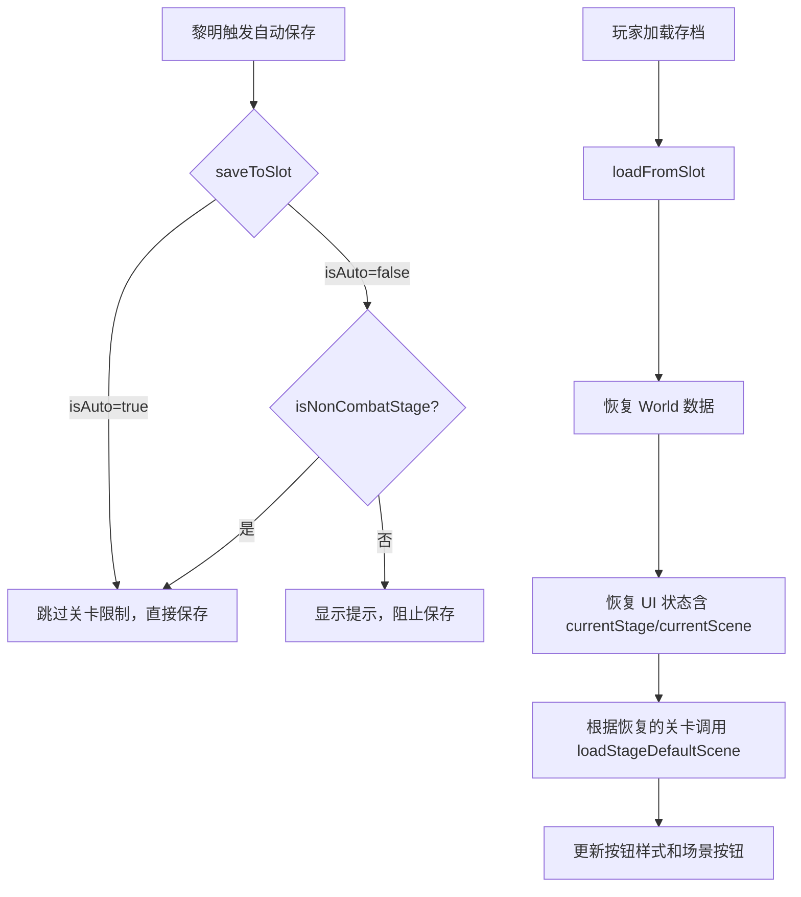

# 设计文档：场景切换加载 Bug 修复

## 概述

本设计修复 `GameUI.loadFromSlot` 和 `GameUI.saveToSlot` 中的两个关联 Bug：

1. `loadFromSlot` 在恢复存档中的 `currentStage`/`currentScene` 后，又无条件覆写为 `village`/`square`
2. `saveToSlot` 中的 `isNonCombatStage` 守卫导致自动保存在战斗关卡中静默失败

修复方案是最小化改动：移除 `loadFromSlot` 中的强制覆写，并在 `saveToSlot` 中区分自动保存和手动保存的关卡限制。

## 架构

无架构变更。修复仅涉及 `src/ui/GameUI.ts` 中两个方法的逻辑调整。



## 组件与接口

### 修改的方法

#### `saveToSlot(slotKey: string, isAuto: boolean)`

当前行为：
```typescript
if (!this.isNonCombatStage(this.currentStage)) {
  if (!isAuto) this.showNotification('⚠️ 只能在村庄中保存游戏', 'warning');
  return; // 自动保存也被阻止
}
```

修复后行为：
```typescript
if (!this.isNonCombatStage(this.currentStage)) {
  if (!isAuto) {
    this.showNotification('⚠️ 只能在村庄中保存游戏', 'warning');
    return;
  }
  // isAuto=true 时继续执行保存
}
```

#### `loadFromSlot(slotKey: string)`

当前行为（第 2407-2409 行）：
```typescript
// 恢复了 uiState.currentStage 和 uiState.currentScene 后...
this.currentStage = 'village';  // 强制覆写
this.currentScene = 'square';   // 强制覆写
```

修复后行为：
```typescript
// 移除强制覆写，使用已恢复的 currentStage 和 currentScene
// 根据恢复的关卡类型调用正确的场景加载逻辑
if (this.isNonCombatStage(this.currentStage)) {
  this.switchScene(this.currentScene);
} else {
  this.loadStageDefaultScene();
}
```

注意：`loadStageDefaultScene` 已经能正确处理战斗关卡（加载背景图和探索面板），所以对于战斗关卡直接调用即可。对于村庄关卡，需要调用 `switchScene` 以加载具体场景（如酒馆、市场等），而非总是加载默认的广场。

## 数据模型

无数据模型变更。存档中已正确保存 `currentStage` 和 `currentScene` 字段。

UI 状态存档结构（相关字段）：
```typescript
interface UIState {
  currentScene: string;   // 'square' | 'tavern' | 'market' | 'farm' | 'camp' | ...
  currentStage: string;   // 'village' | 'grassland' | 'forest' | 'cave'
  // ... 其他字段
}
```


## 正确性属性

*属性是一种在系统所有有效执行中都应成立的特征或行为——本质上是关于系统应该做什么的形式化陈述。属性是人类可读规范与机器可验证正确性保证之间的桥梁。*

### Property 1: 存档加载关卡/场景往返一致性（Round-trip）

*For any* 有效的关卡（village、grassland、forest、cave）和对应的有效场景，将其保存到存档后再加载，恢复后的 `currentStage` 和 `currentScene` 应与保存时的值相同。

**Validates: Requirements 1.1**

### Property 2: 自动保存在所有关卡中均可成功

*For any* 关卡（village、grassland、forest、cave），当 `isAuto=true` 时调用 `saveToSlot`，保存操作应成功完成而不被提前返回。

**Validates: Requirements 2.1, 2.2**

### Property 3: 手动保存在战斗关卡中被阻止

*For any* 战斗关卡（grassland、forest、cave），当 `isAuto=false` 时调用 `saveToSlot`，保存操作应被阻止并显示警告提示。

**Validates: Requirements 2.3**

## 错误处理

- 若存档中的 `currentStage` 或 `currentScene` 为 `undefined` 或无效值，应回退到 `village`/`square` 作为安全默认值
- 现有的 try-catch 错误处理保持不变，加载失败时显示错误通知

## 测试策略

### 属性测试

使用项目现有的 `vitest` 测试框架配合 `fast-check` 进行属性测试（项目中已有 `.property.test.ts` 文件使用此模式）。

- 每个属性测试至少运行 100 次迭代
- 每个测试用注释标注对应的设计属性编号
- 标注格式：**Feature: scene-switch-on-load-bugfix, Property {number}: {property_text}**

### 单元测试

- 验证 `loadFromSlot` 加载战斗关卡存档后 `currentStage` 不被覆写为 `village`
- 验证 `loadFromSlot` 加载村庄存档后正确调用 `switchScene` 而非总是加载广场
- 验证 `saveToSlot` 在 `isAuto=true` 时跳过关卡限制
- 验证 UI 按钮状态在加载后正确更新
